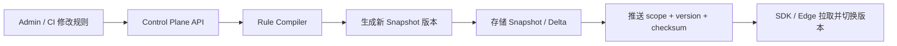
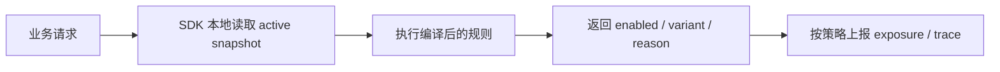

# Feature Management Service Interview Analysis

## 1. 题目拆解

这道题表面上是在设计一个 Feature Management Service，本质上是在考一个高并发配置决策系统如何在多端、多应用、大规模规则下保持低延迟、低成本、可治理、可解释。

题目里真正的关键词有 5 个：

- `thousands of feature flags`：说明不是单机内存 Map 级别的问题，而是需要考虑规则体量、配置分片、增量同步和数据结构设计
- `>100 applications and services`：说明不能把全量配置下发给所有客户端，必须做作用域隔离
- `web portals, backend APIs, and mobile clients`：说明要同时支持服务端和端侧，SDK 一致性是重点
- `high throughput with low latency`：说明评估链路不能依赖中心化强实时查询，必须优先本地评估或边缘评估
- `explainability`：说明不能只返回布尔值，要保留决策证据，能够回答“为什么开/为什么不开”

一句话总结题意：

> 设计一个“控制面和数据面分离、配置推送优先、本地评估优先、决策可回放”的特性开关平台。

## 2. 这道题面试官真正想听什么

### 2.1 不是 CRUD 平台，而是分发 + 评估系统

如果答题重点放在“增删改查 Flag”上，通常会失分。因为管理后台只是控制面，真正难点在：

- 配置怎么编译
- 怎么分发到 SDK
- 怎么在运行时低成本评估
- 配置变更后怎么快速一致地生效

### 2.2 不是缓存题，而是缓存失效策略题

题目直接点名 caching strategy，核心不是“用 Redis”，而是：

- 缓存的 key 怎么设计
- 配置更新怎么失效
- 如何避免单 flag 粒度失效导致的复杂性
- 如何控制随着 flag 总量增长而线性膨胀的内存和带宽成本

### 2.3 不是单 API 设计，而是三类 API 设计

比较完整的答案应该把 API 分成三类：

- 管理 API：创建、修改、发布、回滚、审计
- 分发 API：拉取 snapshot、拉取 delta、订阅变更流
- 评估 API：单条评估、批量评估、Explain

### 2.4 可观测性不是“加监控”就够了

要体现你理解这个系统的问题定位：

- 发布失败
- 配置没传播到客户端
- SDK 使用了陈旧版本
- 不同语言 SDK 评估结果不一致
- 某个用户为什么命中了某个规则

所以 observability 需要覆盖：

- 控制面
- 分发链路
- SDK 状态
- 评估结果
- Explain 追踪

## 3. 现有方案的主线评价

当前 [feature-management-service-architecture.md](D:/YuHui/Studio/Projects_2026/interview-question-202605/feature-management-service-architecture.md) 的主线是正确的，而且已经抓住了这道题最重要的结构：

- 控制面和数据面分离
- Push-first 分发
- Immutable snapshot + delta sync
- Local evaluation 优先
- Explainability 内建

这是一个明显强于“中心化实时查询开关”的答案，因为它解决了扩展性上限问题。

### 3.1 最有价值的设计点

#### 控制面 / 数据面分离

这是全篇最重要的架构判断。原因是：

- 管理侧强调一致性、审计、审批
- 评估侧强调高可用、低延迟、低成本

二者的读写特征、SLO、伸缩方式都不同，分开后架构更清晰。

#### Immutable versioned snapshot

这是缓存设计里最关键的亮点。

相比“改一个 flag 就删一批缓存 key”，版本化 snapshot 的好处是：

- 失效模型简单
- 客户端切换版本可以原子化
- 回滚天然支持
- 可审计性和问题追溯更好

面试时可以直接说：

> 我不会做细粒度 flag cache invalidation，而是把发布动作建模成新版本快照生成，让缓存切换变成版本切换问题。

#### Scope-based packaging

这是“成本控制”部分最能体现经验的点。

如果把上千个 flags 全量推给 100+ 应用，问题会很明显：

- SDK 内存增长
- 移动端启动加载变慢
- 发布后网络分发成本高
- 很多客户端拿到了根本不会用的配置

按 `environment + appScope` 分包，必要时再叠加 `region/tenant`，是很合理的答案。

#### Local evaluation first

这是性能上限的关键。

如果每次页面渲染、接口调用、移动端启动都去请求中心服务判断 flag：

- 中心服务会成为瓶颈
- 网络抖动直接影响业务体验
- 全站延迟和成本都不稳定

本地评估把绝大多数请求从远程 RPC 变成内存规则判断，这一点非常加分。

## 4. 推荐的面试表达顺序

建议按下面顺序讲，比按“模块列表”讲更像资深工程师：

1. 先定义核心目标：低延迟评估、规模扩张可控、规则可解释
2. 再讲总原则：控制面和数据面分离
3. 再讲配置生命周期：编辑规则 -> 编译 -> 生成 snapshot -> 推送版本 -> SDK 切换
4. 再讲评估路径：本地评估为主，远程评估为辅
5. 最后补治理能力：审计、观测、Explain、回滚

可以压缩成一段 1 分钟总结：

> 我会把系统拆成控制面和数据面。控制面负责 Flag 管理、审批、发布和规则编译；数据面负责配置分发和高性能评估。配置发布后不直接改缓存，而是生成按 appScope 切分的 immutable snapshot，通过流式推送通知 SDK 做 delta 或全量更新。运行时优先本地评估，远程评估只做薄客户端和兜底。这样能同时保证低延迟、可扩展、低成本和可解释。

## 5. 面试官可能继续追问的点

### 5.1 为什么不用纯 Redis 存每个 flag

推荐回答：

- 单 flag 粒度缓存失效复杂
- 一次评估通常需要多个规则、segment、release 关联数据，不适合拆散临时拼装
- 批量发布或回滚时一致性和版本管理困难
- 更适合用“预编译后的 scope snapshot”作为运行时读取单元

### 5.2 为什么要 rule compiler

推荐回答：

- 后台可编辑规则通常是 DSL 或结构化 JSON
- 直接在线解析会增加 CPU 成本和多语言行为不一致风险
- 编译后可以把规则转换成 runtime-friendly 结构，比如 match tree、priority list、hashed rollout plan

一句话：

> 编译器的目的是把“人可编辑”规则转换成“机器可高效稳定执行”规则。

### 5.3 多语言 SDK 如何保证一致性

这是高频追问，现有方案也提到了，建议重点说：

- 统一 evaluation spec
- 统一 hash 算法
- 统一 rule precedence
- 统一 null/empty 语义
- 用 golden test vectors 做跨语言兼容测试

这比只说“提供 SDK”更完整。

### 5.4 Explainability 如何避免日志爆炸

建议回答为“两层策略”：

- 默认采样记录 evaluation trace
- 对指定 flag、指定 subject、指定 traceId 开启 debug-on-demand 全量追踪

否则如果每次评估都记录完整决策树，在高 QPS 下成本会很高。

### 5.5 配置变更如何尽快生效又不压垮系统

建议回答：

- 推送的不是全量配置，而是版本变更通知
- 客户端只在版本变化后拉 delta
- delta 不可用时再回退全量 snapshot

这能把“频繁更新”转成“小消息通知 + 按需拉取”。

## 6. 现有方案还可以补强的点

当前方案已经比较完整，但如果要冲更高分，建议主动补这几个方面。

### 6.1 多区域部署策略

题目里提到了 region，最好补一句：

- 控制面可以单主或弱多活
- 数据面和 snapshot 分发建议多区域部署
- SDK 优先连本地区域网关
- 发布版本号需要全局单调或按 scope 单调

这样会显得你考虑到了全球电商场景。

### 6.2 Segment 数据源更新策略

如果 segment 来自外部用户标签、画像、人群包，最好补充：

- segment membership 是静态快照还是动态查询
- 大人群导入如何异步构建
- segment 更新是否触发重新编译和重新发布

这个点很多候选人会漏掉。

### 6.3 紧急开关链路

电商平台会特别在意 incident kill switch，建议补一条：

- 对高优先级 kill switch 设立快速发布链路
- 支持 bypass 常规审批或走更短审批流
- SDK 收到高优先级事件时优先刷新

这样更贴近生产实战。

### 6.4 依赖开关和冲突检测

成熟平台常见增强能力：

- flag prerequisite dependency
- mutually exclusive flags
- 发布前静态校验冲突规则

如果面试官问到复杂规则治理，这会很加分。

### 6.5 实验平台边界

Feature Flag 和 A/B Test 常常会被混问，建议你主动划边界：

- Feature Management 负责开关、灰度、定向、快速回滚
- Experimentation 负责统计显著性、实验分桶分析、指标归因

二者可以共享分桶能力，但不要把实验分析能力全塞进这个系统。

## 7. 可以进一步明确的数据模型

如果面试官要求更细，你可以把核心实体再讲得更落地：

| Entity | 关键字段 | 说明 |
| --- | --- | --- |
| `Flag` | `flagKey`, `type`, `owner`, `status`, `defaultValue` | 开关元数据 |
| `FlagRule` | `ruleId`, `priority`, `conditions`, `rollout`, `variant` | 命中规则 |
| `Segment` | `segmentKey`, `definition`, `version` | 复用人群或目标集合 |
| `ReleaseBinding` | `releaseId`, `flagKey`, `env` | 开关与发布关联 |
| `ConfigSnapshot` | `scope`, `version`, `checksum`, `artifactUri` | 运行时快照 |
| `AuditLog` | `operator`, `action`, `before`, `after`, `time` | 审计记录 |
| `EvaluationTrace` | `traceId`, `flagKey`, `subjectHash`, `reasonCode` | 评估证据 |

## 8. 推荐的核心流程图理解

现有文档里的核心链路可以抽象成 2 条主链路。

### 8.1 发布链路

### 8.2 评估链路

面试时要强调：

- 发布链路重点是版本生产与传播
- 评估链路重点是低延迟和稳定性

## 9. 这份设计最值得强调的 trade-off

### 9.1 选择最终一致性，换取低延迟和高可用

客户端配置更新不是每次发布瞬时强一致，这通常是可以接受的。因为 feature flag 天然更适合：

- 秒级传播
- 最终一致
- 本地容错

### 9.2 选择预编译和批量分发，换取运行时简单

复杂度前移到发布阶段，收益是：

- 运行时更快
- SDK 逻辑更稳定
- 多语言一致性更容易保障

### 9.3 选择 Explainability 内建，接受一部分存储和实现成本

这会增加：

- trace schema 设计成本
- 日志采样与隐私治理成本

但它对排障、合规、灰度回放都非常有价值。

## 10. 如果让我现场优化这份答案，我会怎么补一句

建议你在现有架构总结后补上这一段，比较像面试里的“收口”：

> 这套设计的关键不是把 Flag 存起来，而是把规则编译成适合运行时消费的版本化快照，并按应用作用域分发到 SDK，本地完成绝大多数评估。这样系统容量不会随着全局 Flag 总数线性恶化，同时还保留了回滚、审计、可解释和多端一致性。

## 11. 最终结论

这道题的高分关键，不在于把模块列全，而在于你有没有抓住这 4 个核心判断：

1. 控制面和数据面必须分离
2. 运行时应以本地评估为主，而不是中心化实时查询
3. 缓存管理应以版本化 snapshot 为核心，而不是单 flag 失效
4. Explainability 必须是评估协议的一部分，而不是事后补日志

当前方案已经具备高分答案的骨架。如果继续优化，最值得补的是：

- 多区域部署
- Segment 更新策略
- 紧急 kill switch 机制
- 多语言一致性测试
- Explain trace 的采样与调试策略
