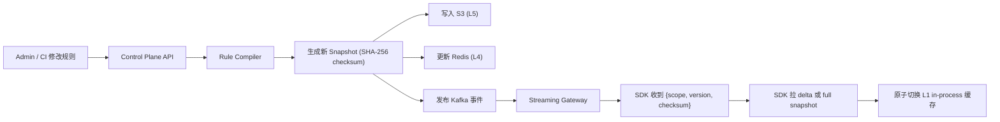
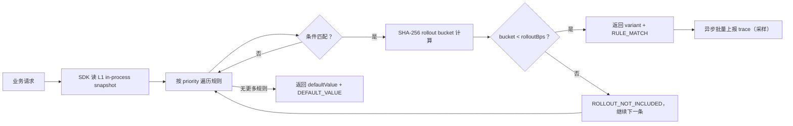

# Feature Management Service Interview Analysis

## 1. 题目拆解

这道题表面上是在设计一个 Feature Management Service，本质上是在考一个高并发配置决策系统如何在多端、多应用、大规模规则下保持低延迟、低成本、可治理、可解释。

题目里真正的关键词有 5 个：

- `thousands of feature flags`：说明不是单机内存 Map 级别的问题，而是需要考虑规则体量、配置分片、增量同步和数据结构设计
- `>100 applications and services`：说明不能把全量配置下发给所有客户端，必须做 appScope 隔离
- `web portals, backend APIs, and mobile clients`：说明要同时支持服务端和端侧，SDK 一致性是重点，且移动端还要考虑离线模式
- `high throughput with low latency`：说明评估链路不能依赖中心化强实时查询，必须优先本地评估——目标是 P99 < 5 ms
- `explainability`：说明不能只返回布尔值，要保留决策证据，能够回答"为什么开/为什么不开"

一句话总结题意：

> 设计一个"控制面和数据面分离、五层缓存、本地评估优先、决策可回放"的特性开关平台。

## 2. 面试官真正想听什么

### 2.1 不是 CRUD 平台，而是分发 + 评估系统

如果答题重点放在"增删改查 Flag"上，通常会失分。因为管理后台只是控制面，真正难点在：

- 配置怎么编译
- 怎么分发到 SDK（push-first，delta sync）
- 怎么在运行时低成本评估（本地评估，不走网络）
- 配置变更后怎么快速一致地生效

### 2.2 不是缓存题，而是五层缓存架构题

题目直接点名 caching strategy，核心不是"用 Redis"，而是：

- 缓存分几层，每层职责是什么
- 缓存 key 怎么设计
- 配置更新怎么失效
- 如何避免单 flag 粒度失效导致的复杂性
- 如何控制随着 flag 总量增长而线性膨胀的内存和带宽成本

完整答案应该覆盖 5 层：

| 层级 | 位置 | 说明 |
| --- | --- | --- |
| L1 | SDK 进程内内存 | 热路径，评估不走网络，P99 < 5 ms |
| L2 | CDN 边缘节点 | 按 version 内容寻址，永不过期，分发成本近乎为零 |
| L3 | JVM / 评估节点共享内存 | 远程评估 API 节点的本地缓存 |
| L4 | Redis 集群 | 跨进程共享，存按 scope 划分的最新快照 |
| L5 | S3 / 对象存储 | 真正的 source of truth，持久化不可变版本 |

### 2.3 不是单 API 设计，而是三类 API 设计

比较完整的答案应该把 API 分成三类：

- 管理 API：创建、修改、发布、回滚、审计
- 分发 API：拉取 snapshot、拉取 delta、订阅变更流
- 评估 API：单条评估、批量评估、Explain

### 2.4 Reason Code 要说全

不少候选人只提"true/false"。评估结果必须带标准化 reason code：

| Code | 触发条件 |
| --- | --- |
| `FLAG_NOT_FOUND` | 快照里没有这个 flagKey |
| `FLAG_DISABLED` | Flag 存在但 `enabled = false` |
| `RULE_MATCH` | 某条规则命中，且 rollout bucket 通过 |
| `ROLLOUT_NOT_INCLUDED` | 规则条件命中，但 subject 被灰度排除 |
| `DEFAULT_VALUE` | 无规则命中，返回 flag 默认值 |

Reason code 是 explainability 的基础，也是排障的核心工具。

### 2.5 可观测性不是"加监控"就够了

要体现你理解这个系统的问题定位场景：

- 发布失败
- 配置没传播到客户端（SDK 版本陈旧）
- 不同语言 SDK 评估结果不一致
- 某个用户为什么命中了某个规则
- 哪些 app 的快照最旧

所以 observability 需要覆盖：控制面、分发链路、SDK 健康状态、评估结果、Explain 追踪。

关键告警阈值：
- 评估 P99 > 5 ms → 立即告警
- 快照传播延迟 > 10 s → 告警
- L4 Redis 命中率 < 85% → 调查
- SDK 重连风暴 > 50 次/秒 → 告警

## 3. 现有方案主线评价

[feature-management-service-architecture.md](feature-management-service-architecture.md) 的主线是正确的，抓住了这道题最重要的结构：

- 控制面和数据面分离
- Push-first 分发 + Kafka 事件总线
- Immutable snapshot + SHA-256 checksum + delta sync
- Local evaluation 优先，P99 < 5 ms
- 五层缓存架构
- K8S 多区域部署，数据面 active-active
- Explainability 内建

这是一个明显强于"中心化实时查询开关"的答案。

### 3.1 最有价值的设计点

#### 控制面 / 数据面分离

这是全篇最重要的架构判断。原因是：

- 管理侧强调一致性、审计、审批
- 评估侧强调高可用、低延迟、低成本

二者的读写特征、SLO、伸缩方式都不同，分开后架构更清晰，可以独立扩缩容。

面试时可以直接说：

> 数据面评估节点可以水平扩展到数百个 Pod，控制面只需要 2 个副本保证 HA 就够了。把他们分开是维持这个扩展比例的前提。

#### Immutable Versioned Snapshot + SHA-256 Checksum

这是缓存设计里最关键的亮点。

相比"改一个 flag 就删一批缓存 key"，版本化快照的好处是：

- 失效模型简单：发布即新版本，不用管旧版本
- 客户端切换版本原子化
- 回滚天然支持
- CDN 按版本内容寻址，永不过期，不需要 purge
- 可审计性和问题追溯更好（知道用的是哪个版本的规则）

面试时可以直接说：

> 我不会做细粒度 flag cache invalidation，而是把发布动作建模成新版本快照生成，让缓存切换变成版本切换问题。CDN 只缓存不可变对象，永远不需要 purge。

#### SHA-256 灰度分桶

```text
bucket = SHA-256(flagKey + ":" + subjectKey) % 10000
enabled = bucket < rolloutBps
```

为什么 SHA-256 而不是 MD5 或取模：
- 跨语言输出一致，不受 JVM/JS 整数溢出影响
- 均匀分布，10000 模数支持 0.01% 精度
- 同一 subject + flag 永远得到相同 bucket（稳定灰度）

这是多语言 SDK 一致性的关键。

#### Scope-Based Packaging

按 `environment + appScope` 分包：

- SDK 内存只包含该应用实际用到的 flags
- 发布后网络分发成本和 CDN 缓存压力都只和该 app 相关
- 移动端启动加载更快

如果把上千个 flags 全量推给 100+ 应用：SDK 内存增长、移动端启动变慢、很多配置根本用不到。

## 4. 推荐的面试表达顺序

建议按下面顺序讲，比按"模块列表"讲更像资深工程师：

1. **定义核心目标**：P99 < 5 ms 评估、规模可控、规则可解释
2. **讲总原则**：控制面和数据面分离
3. **讲配置生命周期**：编辑规则 → Rule Compiler → 生成 immutable snapshot (SHA-256 checksum) → Kafka 通知 → SDK 拉 delta → 原子切换
4. **讲五层缓存**：L1 SDK in-process → L2 CDN → L3 JVM → L4 Redis → L5 S3，说清每层职责
5. **讲评估路径**：本地评估为主（P99 < 5 ms），remote API 为辅
6. **讲 Reason Code**：FLAG_NOT_FOUND / FLAG_DISABLED / RULE_MATCH / ROLLOUT_NOT_INCLUDED / DEFAULT_VALUE
7. **讲治理能力**：审计、观测、Explain、回滚、紧急 kill switch

可以压缩成一段 1 分钟总结：

> 我会把系统拆成控制面和数据面。控制面负责 Flag 管理、审批、发布和规则编译；数据面负责配置分发和高性能评估。配置发布后不直接改缓存，而是 Rule Compiler 生成按 appScope 切分的 immutable snapshot，SHA-256 校验，通过 Kafka 推送版本变更事件，SDK 收到后拉 delta 原子切换。运行时优先本地评估，SDK 进程内读内存，P99 < 5 ms，不走网络。整个分发链路共五层缓存：SDK 进程内 → CDN 边缘 → JVM → Redis → S3。这样系统容量不会随全局 Flag 总数线性恶化，同时保留了回滚、审计、可解释和多语言 SDK 一致性。

## 5. 面试官可能继续追问的点

### 5.1 为什么不用纯 Redis 存每个 flag

推荐回答：

- 单 flag 粒度缓存失效复杂，批量发布时一致性难保证
- 一次评估通常需要多个规则、segment、release 关联数据，拆散临时拼装很低效
- 回滚时需要把一批 key 同时回退，容易出现中间状态
- 更适合用"预编译后的 scope snapshot"作为运行时读取单元
- Snapshot 是 immutable 的，可以放 CDN，Redis 里只是热缓存，不用担心 cache invalidation

### 5.2 为什么要 Rule Compiler

推荐回答：

- 后台可编辑规则通常是 DSL 或结构化 JSON，直接在线解析增加 CPU 成本
- 多语言 SDK 自己各自解析 DSL 容易出现行为分歧
- 编译后把规则转换成 runtime-friendly 结构：match tree、priority list、hashed rollout plan
- 编译时可以做静态校验：flag 依赖检测、规则冲突检测、segment 引用完整性

一句话：

> 编译器的目的是把"人可编辑"规则转换成"机器可高效稳定执行"规则，复杂度前移到发布阶段，运行时只做纯内存查找。

### 5.3 多语言 SDK 如何保证一致性

这是高频追问，建议重点说：

- 统一 evaluation specification（文档约定每一步行为）
- 统一 hash 算法：SHA-256，固定 modulus 10000
- 统一 rule precedence：priority 升序，相同 priority FIFO
- 统一 null/empty 属性语义
- Golden test vectors：每个 SDK 都跑同一套输入 → 期望输出的测试集，CI 强制不能偏离

### 5.4 Explainability 如何避免日志爆炸

建议回答"两层策略"：

- 默认采样记录 evaluation trace（例如 1%）
- 对指定 flagKey、subjectKey 或 traceId 开启 debug-on-demand 全量追踪，无需重新部署
- subjectKey 只以 SHA-256 hash 形式存储，原始 ID 不入日志

否则在高 QPS 下全量记录完整决策树，存储和带宽成本会很高。

### 5.5 配置变更如何尽快生效又不压垮系统

建议回答：

- 推送的不是全量配置，而是 `{scope, newVersion, checksum}` 轻量事件
- 客户端只在版本变化后拉 delta（几 KB）
- delta 不可用时回退全量 snapshot（从 CDN 拉，成本低）
- 紧急 kill switch 走专用高优先级通道，目标 3 秒内触达所有 SDK

### 5.6 如何做多区域部署

- 控制面：active-standby，单主写入，读区域副本
- 数据面：active-active，每个区域独立服务本区域流量
- Snapshot Store（S3）：跨区域 CRR，保证快照在所有区域可用
- CDN：全球 PoP 节点，按 version 内容寻址，边缘命中
- Redis：每个区域独立部署，从 S3 独立加载，无跨区域依赖
- SDK：优先连本地区域 streaming gateway

这样数据面在控制面故障时完全不受影响，SDK 用 stale snapshot 继续工作。

### 5.7 SDK 在控制面/数据面全挂时怎么办

- SDK 持有 L1 in-process 缓存，永远不主动清空
- 移动端 SDK 把 snapshot 持久化到本地存储，下次启动直接 bootstrap
- 每个 flag 可以配置 `failOpen` 或 `failClosed` 策略
- 快照有 `expiresAt` 字段，过期后 SDK 按策略决定继续用还是 fail-safe

### 5.8 如何防止评估结果泄露规则细节给客户端

- remote evaluation API 返回的是结果 + reason code，不返回规则条件本身
- explain API 有访问控制，只有内部工具和授权调试人员可以调用
- Web/移动端 SDK 调用 remote eval，不下载完整 snapshot
- 完整 snapshot（含规则）只下发给可信后端 SDK（通过签名 SDK key 鉴权）

## 6. 现有方案还可以补强的点

当前方案已经比较完整，如果要冲更高分，建议主动补这几个方面。

### 6.1 Segment 数据源更新策略

如果 segment 来自外部用户标签、画像、人群包：

- segment membership 是静态快照还是动态查询？
- 大人群导入（百万级 userId）如何异步构建 bitmap？
- segment 更新是否触发重新编译和重新发布？
- 实时 segment（基于用户属性的在线判断）和静态 segment（预计算的人群包）如何共存？

这个点很多候选人会漏掉。

### 6.2 依赖开关和冲突检测

成熟平台常见增强能力：

- flag prerequisite dependency（A 开启才允许 B 开启）
- mutually exclusive flags（同一实验下 flag 互斥）
- 发布前静态校验冲突规则

如果面试官问到复杂规则治理，这会很加分。

### 6.3 实验平台边界

Feature Flag 和 A/B Test 常常会被混问，建议主动划边界：

- Feature Management 负责：开关、灰度、定向、快速回滚
- Experimentation 负责：统计显著性、实验分桶分析、指标归因

二者可以共享分桶能力（同样是 SHA-256 hash bucketing），但不要把实验分析能力全塞进这个系统。

### 6.4 渐进式发布和自动化回滚

更高级的发布能力：

- 渐进式 rollout：从 1% → 5% → 20% → 100%，每步暂停观测指标
- 自动化回滚：关联错误率/延迟 SLO，超阈值自动触发 rollback
- Canary 与 Feature Flag 联动：canary pod 开启新 flag，稳定后全量

## 7. 可以进一步明确的数据模型

| Entity | 关键字段 | 说明 |
| --- | --- | --- |
| `Application` | `appKey`, `name`, `owner` | 服务/应用注册 |
| `Flag` | `flagKey`, `type`, `enabled`, `defaultValue`, `status` | 开关元数据 |
| `FlagRule` | `ruleId`, `priority`, `conditions`, `rolloutBps`, `variant` | 命中规则；rolloutBps = 0–10000 |
| `Segment` | `segmentKey`, `definition`, `version` | 复用人群或目标集合 |
| `ReleaseBinding` | `releaseId`, `flagKey`, `env` | 开关与发布关联 |
| `ConfigSnapshot` | `appKey`, `env`, `version`, `checksum`, `artifactUri`, `publishedAt` | 运行时不可变快照 |
| `AuditLog` | `actor`, `action`, `resourceType`, `resourceKey`, `before`, `after`, `time` | 审计记录 |
| `EvaluationTrace` | `traceId`, `flagKey`, `subjectHash`, `reasonCode`, `rolloutBucket`, `snapshotVersion` | 采样的评估证据 |

`rolloutBps`（basis points，0–10000）比存 `rolloutPercentage`（0–100）精度更高，0.01% 粒度，存储也更标准。

## 8. 核心流程图

### 8.1 发布链路


```mermaid
flowchart LR
    A["Admin / CI 修改规则"] --> B["Control Plane API"]
    B --> C["Rule Compiler"]
    C --> D["生成新 Snapshot (SHA-256 checksum)"]
    D --> E["写入 S3 (L5)"]
    D --> F["更新 Redis (L4)"]
    D --> G["发布 Kafka 事件"]
    G --> H["Streaming Gateway"]
    H --> I["SDK 收到 {scope, version, checksum}"]
    I --> J["SDK 拉 delta 或 full snapshot"]
    J --> K["原子切换 L1 in-process 缓存"]
```

### 8.2 评估链路（本地 SDK，主路径）


```mermaid
flowchart LR
    A["业务请求"] --> B["SDK 读 L1 in-process snapshot"]
    B --> C["按 priority 遍历规则"]
    C --> D{"条件匹配？"}
    D -- 否 --> C
    D -- 是 --> E["SHA-256 rollout bucket 计算"]
    E --> F{"bucket < rolloutBps？"}
    F -- 是 --> G["返回 variant + RULE_MATCH"]
    F -- 否 --> H["ROLLOUT_NOT_INCLUDED，继续下一条"]
    H --> C
    C -- 无更多规则 --> I["返回 defaultValue + DEFAULT_VALUE"]
    G --> J["异步批量上报 trace（采样）"]
```

面试时要强调：

- 发布链路重点是版本生产与传播（最终一致，秒级生效）
- 评估链路重点是低延迟和稳定性（P99 < 5 ms，不走网络）

## 9. 这份设计最值得强调的 trade-off

### 9.1 选择最终一致性，换取低延迟和高可用

客户端配置更新不是强一致（push 到达需要秒级），这是可以接受的。Feature flag 天然更适合：

- 秒级传播（已经比很多系统快得多）
- 最终一致
- 本地容错（SDK 不依赖控制面活着）

强一致的代价是：每次评估都要访问中心服务，P99 无法保证，可用性绑定到控制面。

### 9.2 选择预编译和批量分发，换取运行时简单

复杂度前移到发布阶段，收益是：

- 运行时 evaluation 是纯内存操作，无 CPU 密集型解析
- SDK 逻辑更稳定，更容易做多语言一致性
- 规则冲突在编译时就能发现，不是在运行时才报错

### 9.3 选择 Explainability 内建，接受存储和实现成本

这会增加：

- trace schema 设计和存储成本（Elasticsearch）
- 日志采样和隐私治理成本（subjectKey hash、PII 脱敏）

但它对排障、合规、灰度回放、多语言一致性验证都非常有价值。

### 9.4 选择 CDN 作为 L2，换取分发扩展性

CDN 对内容寻址的 immutable object 命中率接近 100%。上千个 SDK 同时拉新版本快照时，CDN 承担几乎全部带宽压力，S3 和 origin 服务器不受冲击。这是大规模分发场景的关键。

## 10. 如果让我现场优化这份答案，我会怎么收口

建议在现有架构总结后补上这一段：

> 这套设计的关键不是把 Flag 存起来，而是把规则编译成 SHA-256 校验的版本化快照，按 appScope 分发到 SDK，在进程内完成绝大多数评估。五层缓存从 SDK 内存到 S3 逐层保底，让系统容量不随全局 Flag 总数线性恶化。同时每次评估都带标准化 reason code，让排障、合规审计和多语言一致性验证有可靠的数据基础。

## 11. 最终结论

这道题的高分关键，不在于把模块列全，而在于你有没有抓住这 5 个核心判断：

1. **控制面和数据面必须分离**——不同 SLO、伸缩方式、一致性要求
2. **运行时以本地评估为主**——P99 < 5 ms，不走网络，SDK in-process 内存操作
3. **缓存管理以版本化 snapshot 为核心**——不做单 flag 失效，发布 = 新版本对象，切换原子化
4. **五层缓存各司其职**——L1(SDK) → L2(CDN) → L3(JVM) → L4(Redis) → L5(S3)
5. **Explainability 必须是评估协议的一部分**——reason code、rollout bucket、matched rule 全部内建，不是事后补日志

当前方案已经具备高分答案的骨架。如果继续优化，最值得补的是：

- Segment 数据源更新策略（静态 vs 动态）
- 渐进式发布和自动化回滚
- 多语言 SDK 一致性 golden test vectors
- Explain trace 的采样与调试策略
- 实验平台的边界划定
