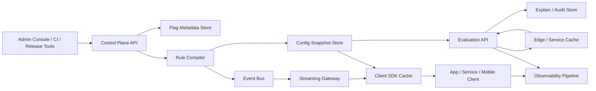
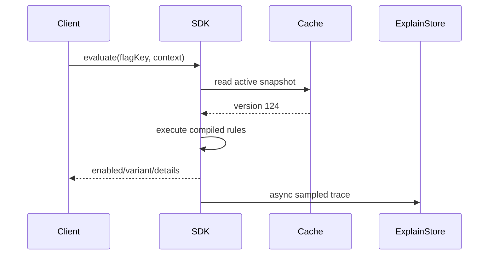
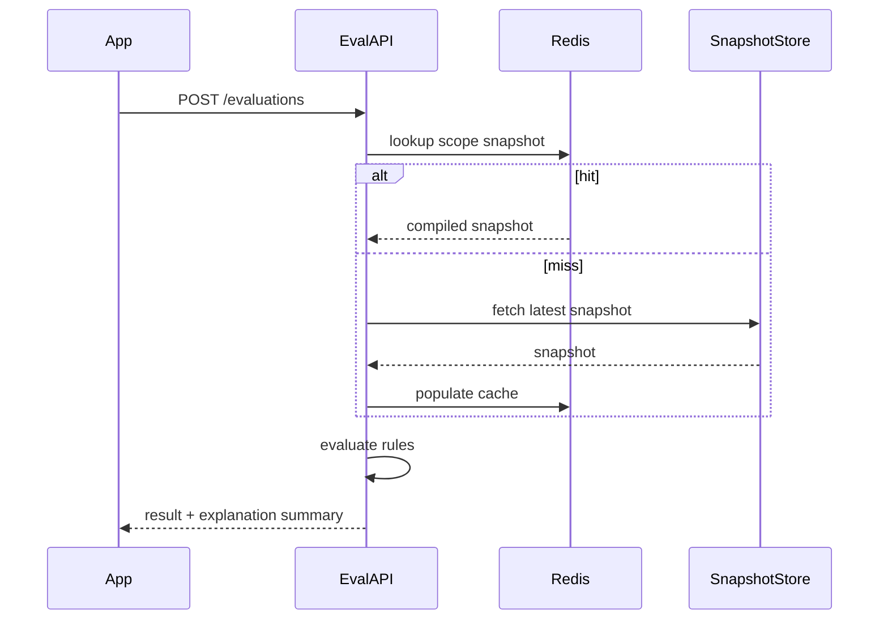

# Feature Management Service Architecture

## 1. Overview

This system is a centralized Feature Management Service for an e-commerce platform that serves more than 100 applications across web, backend, and mobile clients. The primary design goal is to keep flag evaluation latency low while the number of flags, rules, segments, and client applications continues to grow.

The backbone of the design is:

- Control plane for flag authoring, approval, rollout, audit, and publishing
- Data plane for ultra-fast local or edge evaluation
- Push-first distribution with versioned snapshots and delta sync
- Explainability-first evaluation records so every flag decision can be reconstructed

The system separates management workloads from evaluation workloads. Management APIs can tolerate higher latency and stronger consistency. Evaluation APIs and SDKs prioritize availability, low latency, bounded payload size, and predictable cache behavior.

## 2. High-Level Architecture



## 3. Design Principles

- Evaluate close to the caller whenever possible
- Keep config distribution push-first, polling as fallback
- Use immutable, versioned snapshots to simplify cache invalidation
- Compile rules ahead of time to avoid repeated expensive parsing
- Return explanations from the same evaluation model used for decisions
- Bound per-app payload size so growth in global flag count does not linearly increase client memory cost

## 4. Main Components

### 4.1 Control Plane

Responsible for authoring and governance.

- Flag management: create, archive, tag, group, assign ownership
- Environment management: dev, staging, prod, region, tenant
- Rollout management: percentage rollout, allowlists, segment rules, time windows
- Release association: bind flags to release trains, experiments, and incident toggles
- Audit and approval: track who changed what and when

### 4.2 Rule Compiler

Converts editable rules into runtime-optimized artifacts.

- Validates schema and rule references
- Resolves segment dependencies
- Precompiles match trees and percentage rollout instructions
- Produces snapshot bundles and delta events
- Assigns monotonic version numbers per environment and app scope

### 4.3 Snapshot Store

Stores immutable published configurations.

- Keyed by `environment + appScope + version`
- Contains only flags relevant to the target app scope
- Supports full snapshot fetch and delta fetch from a known version
- Can be backed by object storage or a document/key-value store

### 4.4 Distribution Gateway

Delivers new versions to SDKs and edge nodes.

- Server-Sent Events, WebSocket, or gRPC stream for long-lived connections
- Emits lightweight invalidation messages: scope, version, checksum
- Clients fetch delta or full snapshot only when needed

### 4.5 Evaluation Plane

Supports two modes:

- Local SDK evaluation for most mobile/web/backend use cases
- Remote evaluation API for thin clients, server-side templates, and emergency fallback

### 4.6 Explainability and Audit Store

Persists evaluation reasoning samples and all management actions.

- Management audit log is always retained
- Evaluation decision logs are sampled by policy, with debug-on-demand support
- Stores normalized reason codes and context summaries

## 5. Caching Strategy

## 5.1 Core Approach

Use multi-level caching with versioned immutable data.

- L1: in-process SDK cache or service memory cache
- L2: edge/service shared cache such as Redis for remote evaluation nodes
- L3: snapshot store for full source-of-truth published artifacts

Because snapshots are immutable by version, caches do not require fine-grained invalidation of individual flags. A new publish creates a new version. Clients switch versions atomically after fetching and validating the new snapshot.

## 5.2 Scope-Based Packaging

Do not ship all global flags to every client.

- Bundle by application
- Further filter by environment and optionally region/tenant
- Support “global flags” as a separate shared bundle referenced by many apps

This keeps memory and bandwidth roughly proportional to what a client actually uses, not to the total global catalog.

## 5.3 Delta Sync

Clients maintain:

- current version
- checksum
- last successful refresh timestamp

On publish:

1. Distribution gateway pushes `scope/version/checksum`
2. SDK compares local version
3. SDK fetches delta if within retention window
4. SDK falls back to full snapshot if delta chain is missing or checksum fails

## 5.4 Cost Control

- Compress snapshot payloads
- Use precompiled rules instead of raw DSL for runtime evaluation
- Deduplicate shared segments and common targeting metadata in bundle format
- Apply TTL only to fallback polling; primary freshness is event-driven
- Keep remote evaluation caches warm by environment + app scope, not by individual user

## 5.5 Failure Behavior

- SDK continues using last known good snapshot on network loss
- Every snapshot has `publishedAt`, `version`, and optional `expiresAt`
- Policies can declare fail-open or fail-closed per flag category
- Remote evaluation nodes degrade to cached snapshot if control-plane dependencies are unavailable

## 6. SDK Design

## 6.1 SDK Goals

- Same conceptual API across Java, Go, Node.js, iOS, Android, and Web
- Local evaluation by default
- Small integration surface
- Deterministic evaluation behavior across languages

## 6.2 Common SDK Interface

```text
initialize(config)
boolVariation(flagKey, context, defaultValue)
stringVariation(flagKey, context, defaultValue)
numberVariation(flagKey, context, defaultValue)
jsonVariation(flagKey, context, defaultValue)
getEvaluationDetails(flagKey, context, defaultValue)
trackExposure(flagKey, context, result)
flush()
close()
```

`context` should use a normalized schema:

- `subjectKey`: userId/deviceId/sessionId/merchantId
- `attributes`: region, appVersion, platform, locale, membershipLevel, tenantId

## 6.3 SDK Runtime Model

- Bootstrap from local persisted snapshot if available
- Start background stream or poller
- Evaluate against in-memory compiled snapshot
- Emit exposure and health metrics asynchronously
- Support offline mode for mobile apps

## 6.4 Consistency Across Client Types

- Use a shared evaluation specification and compatibility test suite
- Define hashing algorithm, rule precedence, null handling, and percentage rollout semantics centrally
- Publish golden test vectors for every SDK

## 7. API Design

## 7.1 Management APIs

### Flag lifecycle

- `POST /api/v1/flags`
- `GET /api/v1/flags/{flagKey}`
- `PATCH /api/v1/flags/{flagKey}`
- `POST /api/v1/flags/{flagKey}/archive`

### Rule and rollout management

- `POST /api/v1/flags/{flagKey}/rules`
- `PATCH /api/v1/flags/{flagKey}/rules/{ruleId}`
- `POST /api/v1/flags/{flagKey}/publish`
- `POST /api/v1/flags/{flagKey}/rollback`

### Segments and targeting

- `POST /api/v1/segments`
- `GET /api/v1/segments/{segmentKey}`
- `POST /api/v1/segments/{segmentKey}/members:import`

### Release association

- `POST /api/v1/releases`
- `POST /api/v1/flags/{flagKey}/releases/{releaseId}:bind`

### Audit and explain admin

- `GET /api/v1/audit-logs`
- `GET /api/v1/flags/{flagKey}/history`
- `POST /api/v1/evaluations:explain`

## 7.2 Distribution APIs

- `GET /api/v1/configs/{environment}/{appScope}/snapshot`
- `GET /api/v1/configs/{environment}/{appScope}/delta?fromVersion=123`
- `GET /api/v1/configs/stream?environment=prod&appScope=checkout-web`

Snapshot response shape:

```json
{
  "environment": "prod",
  "appScope": "checkout-web",
  "version": 124,
  "checksum": "sha256:...",
  "publishedAt": "2026-05-14T10:00:00Z",
  "flags": [],
  "segments": []
}
```

## 7.3 Evaluation APIs

Single flag:

- `POST /api/v1/evaluations/flags/{flagKey}`

Batch:

- `POST /api/v1/evaluations:batch`

Example request:

```json
{
  "environment": "prod",
  "appScope": "checkout-api",
  "context": {
    "subjectKey": "user-123",
    "attributes": {
      "region": "cn-east",
      "platform": "ios",
      "appVersion": "9.2.1",
      "membershipLevel": "gold"
    }
  }
}
```

Example response:

```json
{
  "flagKey": "new-checkout",
  "enabled": true,
  "variant": "B",
  "version": 124,
  "reasonCode": "SEGMENT_MATCH",
  "matchedRuleId": "rule-8",
  "releaseId": "release-2026-05-checkout",
  "targetRegion": "cn-east"
}
```

## 7.4 Explain API

`POST /api/v1/evaluations:explain`

Response fields:

- final decision
- evaluated environment and app scope
- rules checked in order
- matched segment ids
- excluded conditions
- rollout bucket value
- release binding
- snapshot version
- time of evaluation

## 8. Data Model

Core entities:

- `Flag`: key, type, owner, lifecycle state, default value
- `FlagRule`: priority, conditions, rollout strategy, variant mapping
- `Segment`: reusable targeting definition or imported cohort
- `ReleaseBinding`: release id, deployment metadata, associated flags
- `ConfigSnapshot`: immutable published artifact for a scope/version
- `AuditLog`: management mutation history
- `EvaluationTrace`: sampled or on-demand evaluation evidence

## 9. Evaluation Flow



Remote evaluation path:



## 10. Observability Strategy

## 10.1 Metrics

Control plane:

- publish latency
- compile success/failure rate
- snapshot size by app scope
- active stream connections

Evaluation plane:

- evaluation QPS
- p50/p95/p99 latency
- cache hit rate by layer
- stale snapshot age
- remote fallback rate
- explain request rate
- rule evaluation cost per request

SDK:

- initialization success rate
- stream reconnect count
- last refresh age
- exposure queue backlog

## 10.2 Logs

Structured logs with:

- `flagKey`
- `environment`
- `appScope`
- `version`
- `reasonCode`
- `matchedRuleId`
- `subjectHash`
- `region`
- `releaseId`
- `traceId`

Sensitive attributes should be hashed or redacted.

## 10.3 Tracing

Add OpenTelemetry spans for:

- snapshot fetch
- delta apply
- evaluation
- remote fallback
- explain generation

## 10.4 Alerting

- publish failures above threshold
- snapshot propagation delay too high
- stale snapshot age exceeds SLO
- cache hit rate collapse
- evaluation latency SLO breach
- SDK reconnect storms

## 11. Explainability Model

Every evaluation should be explainable using the same normalized schema whether it came from local SDK evaluation or remote API evaluation.

Required explain fields:

- `isEnabled`
- `variant`
- `flagKey`
- `environment`
- `appScope`
- `region`
- `subjectKeyHash`
- `matchedRuleId`
- `matchedSegmentIds`
- `reasonCode`
- `releaseId`
- `snapshotVersion`
- `evaluatedAt`

Reason code examples:

- `DEFAULT_VALUE`
- `FLAG_DISABLED`
- `SEGMENT_MATCH`
- `SEGMENT_NO_MATCH`
- `PERCENTAGE_ROLLOUT`
- `TARGETING_EXCLUDED`
- `PREREQUISITE_FAILED`
- `STALE_SNAPSHOT_FALLBACK`

This lets the team answer:

- Is the flag enabled
- For which subject or cohort
- In which region or tenant
- Under which release or experiment
- By which exact rule and snapshot version

## 12. Scale and Performance Notes

- Use local evaluation for the vast majority of requests to avoid central bottlenecks
- Keep snapshots app-scoped to avoid full-catalog growth pressure
- Precompile rules to keep evaluation CPU predictable
- Use batch evaluation APIs for server-side rendering or gateway use cases
- Sample decision traces by default and enable full traces only for debug sessions or flagged subjects

## 13. Security and Governance

- RBAC by team, environment, and app scope
- Approval workflow for production publishes
- Audit log for every management mutation
- Signed SDK credentials for config distribution
- Encryption in transit and at rest
- PII minimization in evaluation context and traces

## 14. Suggested Tech Choices

One reasonable implementation stack:

- Control plane API: Java/Spring Boot or Go
- Metadata store: PostgreSQL
- Snapshot store: S3-compatible object storage or document KV store
- Distribution: SSE or gRPC streaming
- Evaluation cache: in-memory + Redis
- Observability: OpenTelemetry + Prometheus + Grafana + ELK

## 15. Recommended Interview Summary

If presenting this in an interview, emphasize these tradeoffs:

1. Separate control plane and data plane
2. Prefer local evaluation with push-based config updates
3. Use immutable versioned snapshots instead of mutating per-flag cache entries
4. Scope config bundles per app/environment to control cost as the catalog grows
5. Build explainability into the evaluation contract, not as a later add-on
