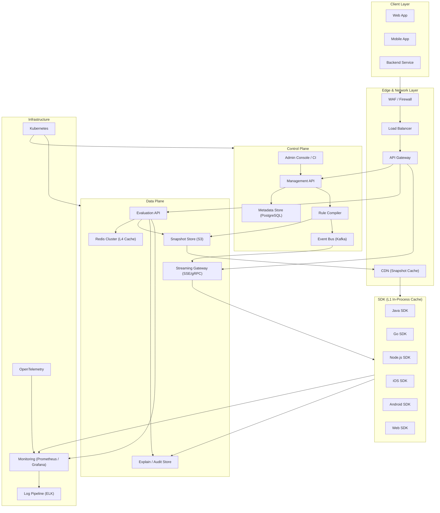
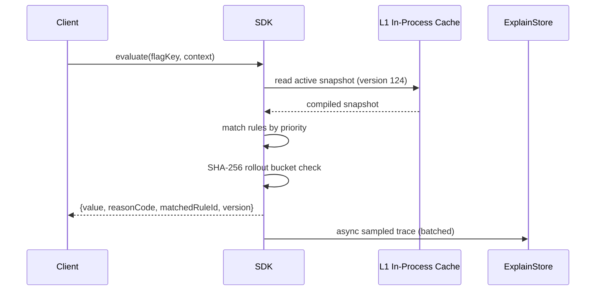
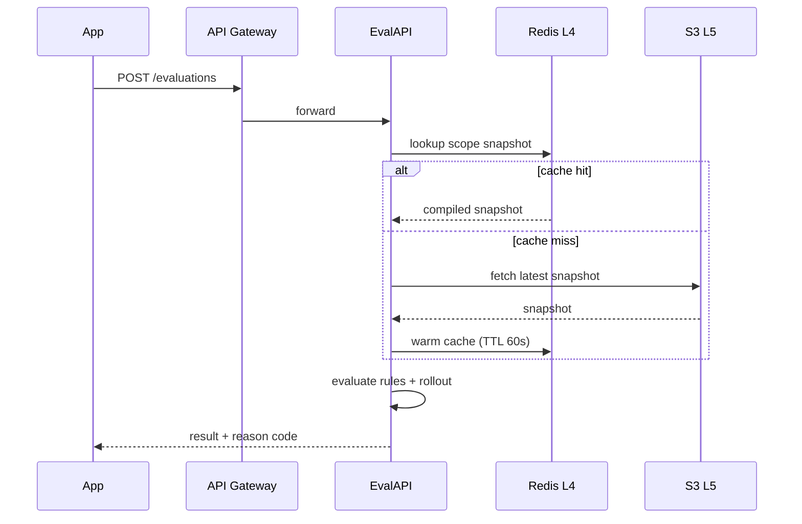

# Feature Management Service Architecture

## 1. Overview

This system is a centralized Feature Management Service for an e-commerce platform that serves more than 100 applications across web, backend, and mobile clients. The primary design goal is to keep flag evaluation latency below P99 5 ms while the number of flags, rules, segments, and client applications continues to grow.

The backbone of the design is:

- Control plane for flag authoring, approval, rollout, audit, and publishing
- Data plane for ultra-fast local or edge evaluation
- Five-level cache hierarchy from SDK in-process cache to database
- Push-first distribution with immutable versioned snapshots and delta sync
- Explainability-first evaluation records so every flag decision can be reconstructed
- Kubernetes-based multi-region deployment with active-active data plane and active-standby control plane

The system separates management workloads from evaluation workloads. Management APIs can tolerate higher latency and stronger consistency. Evaluation APIs and SDKs prioritize availability, low latency, bounded payload size, and predictable cache behavior.

## 2. High-Level Architecture


```mermaid
flowchart TD
    subgraph Client["Client Layer"]
        WebApp["Web App"]
        MobileApp["Mobile App"]
        BackendSvc["Backend Service"]
    end

    subgraph Edge["Edge & Network Layer"]
        WAF["WAF / Firewall"]
        CDN["CDN (Snapshot Cache)"]
        LB["Load Balancer"]
        GW["API Gateway"]
    end

    subgraph ControlPlane["Control Plane"]
        AdminUI["Admin Console / CI"]
        MgmtAPI["Management API"]
        Compiler["Rule Compiler"]
        MetaDB["Metadata Store (PostgreSQL)"]
        EventBus["Event Bus (Kafka)"]
    end

    subgraph DataPlane["Data Plane"]
        EvalAPI["Evaluation API"]
        StreamGW["Streaming Gateway (SSE/gRPC)"]
        SnapshotStore["Snapshot Store (S3)"]
        RedisCluster["Redis Cluster (L4 Cache)"]
        ExplainStore["Explain / Audit Store"]
    end

    subgraph SDK["SDK (L1 In-Process Cache)"]
        JavaSDK["Java SDK"]
        GoSDK["Go SDK"]
        JSSDKNode["Node.js SDK"]
        iOSSDK["iOS SDK"]
        AndroidSDK["Android SDK"]
        WebSDK["Web SDK"]
    end

    subgraph Infra["Infrastructure"]
        K8S["Kubernetes"]
        Monitor["Monitoring (Prometheus / Grafana)"]
        OTel["OpenTelemetry"]
        ELK["Log Pipeline (ELK)"]
    end

    Client --> WAF --> LB --> GW
    GW --> MgmtAPI
    GW --> EvalAPI
    GW --> StreamGW
    AdminUI --> MgmtAPI
    MgmtAPI --> MetaDB
    MgmtAPI --> Compiler
    Compiler --> SnapshotStore
    Compiler --> EventBus
    EventBus --> StreamGW
    SnapshotStore --> CDN
    CDN --> SDK
    StreamGW --> SDK
    EvalAPI --> RedisCluster
    EvalAPI --> SnapshotStore
    EvalAPI --> ExplainStore
    SDK --> ExplainStore
    SDK --> Monitor
    EvalAPI --> Monitor
    K8S --> ControlPlane
    K8S --> DataPlane
    OTel --> Monitor
    Monitor --> ELK
```

## 3. Design Principles

- Evaluate close to the caller whenever possible — P99 < 5 ms for in-process SDK evaluation
- Keep config distribution push-first, polling as fallback
- Use immutable, SHA-256 checksummed snapshots to simplify cache invalidation
- Compile rules ahead of time to avoid repeated expensive parsing at runtime
- Return standardized reason codes from the same evaluation model used for decisions
- Scope payloads by `environment + appScope` so growth in global flag count does not linearly increase client memory cost
- Five-level cache hierarchy to minimize remote calls at each layer

## 4. Main Components

### 4.1 Control Plane

Responsible for authoring and governance.

- Flag management: create, archive, tag, group, assign ownership, set default values
- Environment management: dev, staging, prod, region, tenant
- Rollout management: percentage rollout, allowlists, segment rules, time windows
- Release association: bind flags to release trains, experiments, and incident kill switches
- Audit and approval: track who changed what and when, enforce approval workflows for production

### 4.2 Rule Compiler

Converts editable rules into runtime-optimized artifacts.

- Validates schema and rule references
- Resolves segment dependencies and checks for conflicts (prerequisite chains, mutex flags)
- Precompiles match trees and SHA-256-based percentage rollout plans
- Produces immutable snapshot bundles and delta events
- Assigns monotonic version numbers per `environment + appScope`
- Publishes version change events to Kafka for fan-out distribution

### 4.3 Snapshot Store (L5)

Stores immutable published configurations as the source of truth.

- Keyed by `environment + appScope + version`
- Contains only flags relevant to the target app scope
- Supports full snapshot fetch and delta fetch from a known version
- Backed by S3-compatible object storage
- Served through CDN for edge caching (L2)

### 4.4 Distribution Gateway

Delivers new versions to SDKs and edge nodes.

- Server-Sent Events, WebSocket, or gRPC streaming for long-lived connections
- Emits lightweight invalidation messages: `{scope, version, checksum}`
- Clients fetch delta or full snapshot only when needed
- Falls back to CDN pull or direct S3 fetch if streaming is unavailable

### 4.5 Evaluation Plane

Supports two modes:

- **Local SDK evaluation** (preferred): in-process, zero network latency, P99 < 5 ms
- **Remote Evaluation API**: for thin clients, server-side templates, and emergency fallback

Remote evaluation nodes load snapshots from Redis (L4) first, then fall back to S3 (L5). Results are not cached at the user level — only at the scope level.

### 4.6 Explainability and Audit Store

Persists evaluation reasoning samples and all management actions.

- Management audit log is always retained
- Evaluation decision logs are sampled by policy, with debug-on-demand support per flagKey, subjectKey, or traceId
- Stores normalized reason codes and context summaries
- Backed by Elasticsearch or a columnar store for query performance

### 4.7 API Gateway and Edge Layer

- WAF / Firewall: DDoS protection, IP allowlisting for SDK distribution
- CDN: caches immutable snapshot artifacts by version; cache hit rate target > 95%
- Load Balancer: L4/L7 routing, health-based routing across K8S pods
- API Gateway: authentication, rate limiting, routing to control plane vs. data plane

## 5. Five-Level Cache Hierarchy

### 5.1 Cache Levels

| Level | Location | Scope | Invalidation | Latency |
| --- | --- | --- | --- | --- |
| L1 | SDK in-process memory | per app process | version push event | < 1 ms |
| L2 | CDN edge node | per `scope + version` (immutable) | content-addressed, never evicted | < 5 ms |
| L3 | JVM / process shared cache | per evaluation node | version push event | < 2 ms |
| L4 | Redis cluster | per `environment + appScope` | version change publish | < 5 ms |
| L5 | S3 / object storage | per `scope + version` (immutable) | never invalidated | < 100 ms |

Because snapshots are immutable by version, L2 and L5 never need explicit invalidation. A new publish creates a new version object. Clients switch versions atomically after fetching and validating the checksum.

### 5.2 Scope-Based Packaging

Do not ship all global flags to every client.

- Bundle by `appScope`: each application only receives its relevant flags
- Filter by `environment`: dev, staging, prod are always separate snapshots
- Optionally filter by `region` or `tenant` for further partitioning
- Global flags (shared across apps) can be a separate named scope referenced by many apps

This keeps memory and bandwidth roughly proportional to what a client actually uses.

### 5.3 Delta Sync Protocol

Client state maintained by SDK:

```json
{
  "scope": "prod:checkout-web",
  "version": 124,
  "checksum": "sha256:abc123",
  "lastRefreshedAt": "2026-05-21T08:00:00Z"
}
```

On publish:

1. Compiler generates new snapshot version and publishes `{scope, newVersion, checksum}` to Kafka
2. Streaming gateway fans out to all connected SDK instances for that scope
3. SDK compares received version to local version
4. If delta is available and within retention window, fetch delta only
5. If delta chain is broken or checksum fails, fetch full snapshot from CDN (L2) or S3 (L5)
6. SDK atomically replaces in-memory snapshot and updates local state

### 5.4 Cost Controls

- Compress snapshot payloads (Brotli or gzip)
- Use precompiled rule structures instead of raw DSL for runtime evaluation
- Deduplicate shared segments and common targeting metadata in bundle format
- Apply TTL only to fallback polling; primary freshness is event-driven
- Keep Redis keys at `environment:appScope` granularity, not per user

### 5.5 Failure Behavior

- SDK continues using last known good snapshot on network loss or streaming disconnection
- Every snapshot includes `publishedAt`, `version`, and optional `expiresAt`
- Policies declare `failOpen` or `failClosed` per flag category
- Remote evaluation nodes degrade to cached Redis snapshot if streaming and S3 are unreachable
- Mobile SDKs persist last snapshot to local storage for offline startup

## 6. SDK Design

### 6.1 Goals

- Same conceptual API across Java, Go, Node.js, iOS, Android, and Web
- Local evaluation by default — zero network calls on hot path
- Small integration surface
- Deterministic evaluation behavior across all languages
- Offline-safe for mobile clients

### 6.2 Common SDK Interface

```text
initialize(config): Promise<void>
boolVariation(flagKey, context, defaultValue): boolean
stringVariation(flagKey, context, defaultValue): string
numberVariation(flagKey, context, defaultValue): number
jsonVariation(flagKey, context, defaultValue): object
getEvaluationDetails(flagKey, context, defaultValue): EvaluationDetails
trackExposure(flagKey, context, result): void
flush(): Promise<void>
close(): void
```

`EvaluationDetails` response:

```json
{
  "flagKey": "new-checkout",
  "value": true,
  "reasonCode": "RULE_MATCH",
  "matchedRuleId": "rule-8",
  "snapshotVersion": 124,
  "evaluatedAt": "2026-05-21T08:00:01Z"
}
```

Normalized `context` schema:

- `subjectKey`: userId / deviceId / sessionId / merchantId
- `attributes`: region, appVersion, platform, locale, membershipLevel, tenantId

### 6.3 SDK Runtime Model

1. Bootstrap from local persisted snapshot if available (mobile offline start)
2. Start background streaming connection (SSE or gRPC) for push updates
3. Fall back to polling if streaming unavailable
4. Evaluate flags against in-memory compiled snapshot — no network call
5. Emit exposure events and health metrics asynchronously via batched queue
6. On version push: fetch delta or full snapshot, validate checksum, atomically swap

### 6.4 Cross-Language Consistency

- Shared evaluation specification document
- SHA-256 hash algorithm for percentage rollout bucketing: `hash(flagKey + ":" + subjectKey) % 10000`
- Defined rule precedence: priority ascending, FIFO within equal priority
- Defined null / empty attribute handling
- Golden test vectors for every SDK — CI enforces no divergence

## 7. Evaluation Engine

### 7.1 Evaluation Steps

For each `evaluate(flagKey, context)` call:

1. Load active snapshot from L1 (in-process SDK cache)
2. Look up `flagKey` in snapshot — if not found, return caller-provided default with reason `FLAG_NOT_FOUND`
3. If flag `enabled = false`, return flag default value with reason `FLAG_DISABLED`
4. Iterate rules by priority (ascending):
   - If rule conditions do not match context attributes, continue
   - If rule conditions match, compute rollout bucket: `SHA-256(flagKey + ":" + subjectKey) % 10000`
   - If bucket < rollout threshold, return rule variation with reason `RULE_MATCH`
   - If bucket >= rollout threshold, continue with reason `ROLLOUT_NOT_INCLUDED`
5. If no rule matched or all rollout checks excluded the subject, return flag default value with reason `DEFAULT_VALUE`

### 7.2 Reason Codes

| Code | Meaning |
| --- | --- |
| `FLAG_NOT_FOUND` | Flag key does not exist in snapshot |
| `FLAG_DISABLED` | Flag exists but global enabled = false |
| `RULE_MATCH` | A targeting rule matched and rollout bucket passed |
| `ROLLOUT_NOT_INCLUDED` | A rule matched but subject fell outside rollout percentage |
| `DEFAULT_VALUE` | No rule matched; flag default value returned |
| `PREREQUISITE_FAILED` | A required prerequisite flag was not enabled |
| `STALE_SNAPSHOT_FALLBACK` | Evaluation used an expired snapshot due to network failure |

### 7.3 Percentage Rollout

```text
bucket = SHA-256(flagKey + ":" + subjectKey) % 10000
enabled = bucket < (rolloutPercentage * 100)
```

Using 10,000 as modulus allows 0.01% granularity. SHA-256 guarantees uniform distribution and consistent cross-language results.

## 8. API Design

### 8.1 Management APIs

Flag lifecycle:
- `POST   /api/v1/flags`
- `GET    /api/v1/flags/{flagKey}`
- `PATCH  /api/v1/flags/{flagKey}`
- `POST   /api/v1/flags/{flagKey}/archive`

Rule and rollout management:
- `POST   /api/v1/flags/{flagKey}/rules`
- `PATCH  /api/v1/flags/{flagKey}/rules/{ruleId}`
- `DELETE /api/v1/flags/{flagKey}/rules/{ruleId}`
- `POST   /api/v1/flags/{flagKey}/publish`
- `POST   /api/v1/flags/{flagKey}/rollback`

Segments and targeting:
- `POST   /api/v1/segments`
- `GET    /api/v1/segments/{segmentKey}`
- `POST   /api/v1/segments/{segmentKey}/members:import`

Release association:
- `POST   /api/v1/releases`
- `POST   /api/v1/flags/{flagKey}/releases/{releaseId}:bind`

Audit and explain admin:
- `GET    /api/v1/audit-logs`
- `GET    /api/v1/flags/{flagKey}/history`
- `POST   /api/v1/evaluations:explain`

### 8.2 Distribution APIs

- `GET /api/v1/configs/{environment}/{appScope}/snapshot`
- `GET /api/v1/configs/{environment}/{appScope}/delta?fromVersion=123`
- `GET /api/v1/configs/stream?environment=prod&appScope=checkout-web`

Snapshot response:

```json
{
  "environment": "prod",
  "appScope": "checkout-web",
  "version": 124,
  "checksum": "sha256:abc123ef...",
  "publishedAt": "2026-05-21T08:00:00Z",
  "flags": [],
  "segments": []
}
```

### 8.3 Evaluation APIs

Single flag:
- `POST /api/v1/evaluations/flags/{flagKey}`

Batch:
- `POST /api/v1/evaluations:batch`

Request:

```json
{
  "environment": "prod",
  "appScope": "checkout-api",
  "context": {
    "subjectKey": "user-123",
    "attributes": {
      "region": "cn-east",
      "platform": "ios",
      "appVersion": "9.2.1",
      "membershipLevel": "gold"
    }
  }
}
```

Response:

```json
{
  "flagKey": "new-checkout",
  "enabled": true,
  "variant": "B",
  "version": 124,
  "reasonCode": "RULE_MATCH",
  "matchedRuleId": "rule-8",
  "releaseId": "release-2026-05-checkout",
  "evaluatedAt": "2026-05-21T08:00:01Z"
}
```

### 8.4 Explain API

`POST /api/v1/evaluations:explain`

Response:

```json
{
  "flagKey": "new-checkout",
  "finalValue": true,
  "reasonCode": "RULE_MATCH",
  "environment": "prod",
  "appScope": "checkout-api",
  "subjectKeyHash": "sha256:...",
  "matchedRuleId": "rule-8",
  "matchedSegmentIds": ["seg-gold-users"],
  "evaluatedRuleCount": 3,
  "rolloutBucket": 3721,
  "rolloutThreshold": 5000,
  "releaseId": "release-2026-05-checkout",
  "snapshotVersion": 124,
  "evaluatedAt": "2026-05-21T08:00:01Z"
}
```

## 9. Data Model

| Entity | Key Fields | Notes |
| --- | --- | --- |
| `Application` | `appKey`, `name`, `owner` | Service / app registration |
| `Flag` | `flagKey`, `appKey`, `type`, `enabled`, `defaultValue`, `status` | Flag metadata |
| `FlagRule` | `ruleId`, `flagId`, `priority`, `conditions`, `rolloutBps`, `variant` | Targeting rule; rollout in basis points (0–10000) |
| `Segment` | `segmentKey`, `definition`, `version` | Reusable targeting cohort |
| `ReleaseBinding` | `releaseId`, `flagKey`, `environment` | Release train association |
| `ConfigSnapshot` | `appKey`, `environment`, `version`, `checksum`, `artifactUri`, `publishedAt` | Immutable runtime artifact |
| `AuditLog` | `actor`, `action`, `resourceType`, `resourceKey`, `before`, `after`, `time` | Management mutation history |
| `EvaluationTrace` | `traceId`, `flagKey`, `subjectHash`, `reasonCode`, `snapshotVersion`, `evaluatedAt` | Sampled decision evidence |

## 10. Evaluation Flow

Local SDK path (primary):


```mermaid
sequenceDiagram
    participant Client
    participant SDK
    participant L1Cache as L1 In-Process Cache
    participant ExplainStore

    Client->>SDK: evaluate(flagKey, context)
    SDK->>L1Cache: read active snapshot (version 124)
    L1Cache-->>SDK: compiled snapshot
    SDK->>SDK: match rules by priority
    SDK->>SDK: SHA-256 rollout bucket check
    SDK-->>Client: {value, reasonCode, matchedRuleId, version}
    SDK->>ExplainStore: async sampled trace (batched)
```

Remote evaluation path (thin clients / fallback):


```mermaid
sequenceDiagram
    participant App
    participant GW as API Gateway
    participant EvalAPI
    participant L4Cache as Redis L4
    participant L5Store as S3 L5

    App->>GW: POST /evaluations
    GW->>EvalAPI: forward
    EvalAPI->>L4Cache: lookup scope snapshot
    alt cache hit
        L4Cache-->>EvalAPI: compiled snapshot
    else cache miss
        EvalAPI->>L5Store: fetch latest snapshot
        L5Store-->>EvalAPI: snapshot
        EvalAPI->>L4Cache: warm cache (TTL 60s)
    end
    EvalAPI->>EvalAPI: evaluate rules + rollout
    EvalAPI-->>App: result + reason code
```

## 11. Kubernetes and Multi-Region Deployment

### 11.1 K8S Architecture

```
Kubernetes Cluster (per region)
├── Namespace: feature-control-plane
│   ├── Deployment: management-api          (2 replicas, HPA)
│   ├── Deployment: rule-compiler           (1–3 replicas)
│   ├── StatefulSet: kafka                  (3 brokers)
│   └── Service + Ingress
│
├── Namespace: feature-data-plane
│   ├── Deployment: evaluation-api          (3–10 replicas, HPA)
│   ├── Deployment: streaming-gateway       (3 replicas)
│   ├── StatefulSet: redis-cluster          (3 primary + 3 replica)
│   └── Service + Ingress
│
└── Namespace: feature-infra
    ├── Deployment: prometheus
    ├── Deployment: grafana
    └── DaemonSet: otel-collector
```

### 11.2 Multi-Region Strategy

| Component | Strategy | Notes |
| --- | --- | --- |
| Control plane | Active-standby | Single primary write region; standby promotes on failure |
| Metadata database (PostgreSQL) | Primary + read replicas | Writes to primary, reads from regional replica |
| Snapshot store (S3) | Cross-region replication | CRR ensures snapshots available in all regions |
| CDN | Global PoPs | Serves immutable snapshot versions at edge |
| Data plane (Evaluation API) | Active-active | Each region serves its local traffic independently |
| Redis cluster | Per-region | Populated from S3 independently; no cross-region dependency |
| Streaming gateway | Per-region | SDKs connect to local region gateway |

### 11.3 Disaster Recovery

- **RTO**: Data plane < 30 seconds (SDK falls back to stale snapshot automatically)
- **RTO**: Control plane < 5 minutes (promote standby)
- **RPO**: Snapshots are replicated to S3 CRR — no data loss after publish
- **SDK resilience**: Last known good snapshot held in L1 cache indefinitely until connectivity restores

### 11.4 Emergency Kill Switch

For high-priority incident kill switches:

- Dedicated fast-publish lane bypassing normal approval workflow
- Marked as `priority: critical` — streaming gateway fans out to SDKs within 3 seconds
- SDK processes critical version events before normal version events in queue

## 12. Observability Strategy

### 12.1 Metrics

Control plane:
- publish latency (p50/p95/p99)
- compiler success/failure rate
- snapshot size by app scope
- active streaming connections

Data plane:
- evaluation QPS
- evaluation p50/p95/p99 latency — alert if P99 > 5 ms
- cache hit rate by layer (L1, L4)
- stale snapshot age
- remote fallback rate
- explain request rate

SDK:
- initialization success rate
- stream reconnect count
- last snapshot refresh age
- exposure queue backlog

### 12.2 Structured Logs

All evaluation logs include:

```json
{
  "flagKey": "...",
  "environment": "prod",
  "appScope": "...",
  "snapshotVersion": 124,
  "reasonCode": "RULE_MATCH",
  "matchedRuleId": "...",
  "subjectHash": "sha256:...",
  "region": "cn-east",
  "releaseId": "...",
  "traceId": "..."
}
```

Sensitive attributes are hashed or redacted before logging.

### 12.3 Distributed Tracing

OpenTelemetry spans for:
- snapshot fetch (L4 hit / L5 miss)
- delta apply
- rule evaluation
- rollout bucket computation
- remote fallback activation
- explain generation

### 12.4 Alerting Thresholds

| Signal | Threshold | Action |
| --- | --- | --- |
| Publish failure rate | > 1% | Page on-call |
| Snapshot propagation delay | > 10 s | Alert |
| Stale snapshot age | > SLO window | Alert |
| L4 cache hit rate | < 85% | Investigate |
| Evaluation P99 latency | > 5 ms | Alert |
| SDK reconnect storm | > 50 reconnects/s | Alert |

## 13. Explainability Model

Every evaluation must be explainable using the same normalized schema whether it originated from local SDK evaluation or remote API evaluation.

Required explain fields:

| Field | Description |
| --- | --- |
| `isEnabled` | Final boolean result |
| `variant` | Variation value returned |
| `flagKey` | Flag identifier |
| `environment` | Evaluation environment |
| `appScope` | Application scope |
| `region` | Request region |
| `subjectKeyHash` | SHA-256 hash of original subject key |
| `matchedRuleId` | Rule that produced the result |
| `matchedSegmentIds` | Segment memberships that were used |
| `reasonCode` | Standardized reason (see Section 7.2) |
| `rolloutBucket` | Hash bucket value (0–9999) |
| `rolloutThreshold` | Configured threshold for this rule |
| `releaseId` | Associated release binding |
| `snapshotVersion` | Version of snapshot used for evaluation |
| `evaluatedAt` | Timestamp of evaluation |

This lets the team answer:
- Is the flag enabled — and why
- For which subject or cohort, in which region or tenant
- Under which release or experiment
- By which exact rule and snapshot version
- What was the exact rollout bucket vs. threshold

## 14. Security and Governance

- RBAC by team, environment, and app scope
- Approval workflow for production publishes (configurable, with fast-path for kill switches)
- Immutable audit log for every management mutation
- Signed SDK credentials for config distribution (rotating API keys)
- Encryption in transit (TLS 1.3) and at rest (AES-256)
- PII minimization: subject keys hashed with SHA-256 before logging
- WAF rules blocking abnormal snapshot polling burst patterns

## 15. Tech Stack

| Component | Technology |
| --- | --- |
| Control plane API | Java 17 / Spring Boot 3 |
| Rule compiler | Java 17 |
| Metadata store | PostgreSQL 16 |
| Snapshot store | S3-compatible object storage |
| Event bus | Kafka |
| Distribution gateway | Spring WebFlux (SSE) or gRPC |
| Evaluation cache (L4) | Redis Cluster |
| Explainability store | Elasticsearch |
| Container orchestration | Kubernetes (EKS / GKE / ACK) |
| CDN | CloudFront / Akamai / Alibaba CDN |
| Observability | OpenTelemetry + Prometheus + Grafana + ELK |
| SDK languages | Java, Go, Node.js, iOS (Swift), Android (Kotlin), Web (TypeScript) |

## 16. Interview Summary

If presenting this in an interview, emphasize these tradeoffs:

1. **Control plane / data plane separation** — different SLOs, scale behaviors, and consistency requirements
2. **Local evaluation first** — P99 < 5 ms because evaluation is in-process against an in-memory snapshot
3. **Immutable versioned snapshots** — simplifies cache invalidation to version switching, enables atomic rollback
4. **Five-level cache hierarchy** — each layer protects the next; CDN makes snapshot distribution nearly free at scale
5. **Scope-based packaging** — app payload size stays proportional to what that app uses, not the global catalog
6. **Explainability in the evaluation contract** — not a log afterthought; every decision is reconstructable
7. **SHA-256 rollout hashing at 0.01% granularity** — consistent across all SDK languages, stable per user

One-minute summary:

> I split the system into a control plane for authoring, approval, and publishing, and a data plane for high-performance evaluation. Configuration changes compile into immutable, SHA-256 checksummed snapshots scoped per application. A five-level cache hierarchy — SDK in-process, CDN edge, JVM, Redis, and S3 — ensures most evaluation requests never leave the process. A Kafka-driven streaming gateway notifies SDKs of new versions within seconds, and SDKs fetch only the delta. This design keeps evaluation at P99 < 5 ms, scales the data plane independently, and makes every flag decision fully reconstructable.
