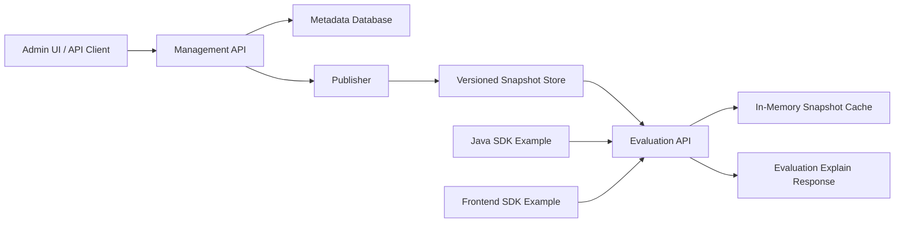

# Feature Management Service Design

## 1. Purpose

This document describes a practical design for a Feature Management Service for an e-commerce platform. The system manages feature flags across web portals, backend services, and mobile clients. It needs to support low-latency evaluation, controlled rollout, clear ownership, and explainable decisions.

Because this is a take-home interview project, the design intentionally separates:

- what a production-grade system should support
- what the demo implementation should build
- what should be documented but not implemented in the demo

The goal of the demo is not to rebuild LaunchDarkly. The goal is to show strong engineering judgment: clear architecture, useful APIs, deterministic evaluation behavior, reasonable caching, test coverage, and a path from demo to production.

## 2. Requirement Summary

The service should support:

- Thousands of feature flags across more than 100 applications and services
- Web, backend, and mobile clients
- High-throughput and low-latency flag evaluation
- Cost-effective caching as the feature catalog grows
- A client SDK model that is easy to integrate
- Management, evaluation, and supporting APIs
- Observability and debugging support
- Explainability for each decision, including who, where, which rule, which release, and which snapshot version

## 3. Design Philosophy

The most important design choice is to split the system into two planes.

The control plane manages authoring, validation, publishing, audit, and governance. It can tolerate higher latency and stronger consistency requirements.

The data plane serves flag evaluation. It should be fast, highly available, cache-friendly, and independent from the control plane during normal runtime.

For the demo, this split can be represented inside a single Spring Boot application. The code should still keep the boundaries clear through packages and service responsibilities.

## 4. High-Level Architecture



Production architecture would extend this with a streaming distribution gateway, edge caches, multi-region deployment, Redis, object storage, audit pipelines, and OpenTelemetry.

The demo should keep the architecture simple:

- One Spring Boot backend
- One local relational database
- One in-memory snapshot cache
- One Vue admin frontend
- One Java SDK example
- One frontend SDK example
- Focused unit and integration tests

## 5. Production vs Demo Scope

| Area | Production Design | Demo Implementation |
| --- | --- | --- |
| Backend | Control plane and data plane can be separately deployed | Single Spring Boot application with clear package boundaries |
| Database | Oracle | Local H2 or SQLite for easy setup |
| Cache | SDK local cache, Redis, edge cache, immutable snapshots | In-memory snapshot cache in the backend |
| Config distribution | SSE, WebSocket, or gRPC streaming with delta sync | Manual publish creates a new snapshot version |
| SDK | Java, Go, Node.js, iOS, Android, Web | Java SDK example and small frontend SDK example |
| Frontend | Full admin console with RBAC and approval workflows | Vue UI for managing flags, rules, publishing, and testing evaluation |
| Observability | OpenTelemetry, metrics, tracing, audit pipeline | Structured logs, health endpoint, basic metrics-ready design |
| Security | RBAC, environment-level permissions, signed SDK keys | Simple API key or no auth, documented as demo scope |
| Explainability | Stored sampled traces and debug-on-demand traces | Explain API returns decision details synchronously |

## 6. Recommended Demo Scope

The demo should be small enough to finish at home while still showing the core design.

Recommended implementation:

1. Spring Boot backend
2. Local database using H2 or SQLite
3. REST APIs for flag management, publishing, evaluation, and explanation
4. In-memory snapshot cache keyed by `environment + appKey + version`
5. Basic Vue frontend for managing and testing flags
6. Java SDK example
7. Frontend SDK example
8. Java unit tests for the evaluation engine
9. A short README explaining production extensions

Recommended non-goals for the demo:

- Multi-region deployment
- Real-time streaming distribution
- Redis
- Oracle-specific stored procedures
- Full RBAC and approval workflows
- Multi-language SDK matrix
- Full observability stack
- Large-scale segment import

This scope is realistic for a take-home assignment and still demonstrates the important architecture decisions.

## 7. Backend Design

### 7.1 Should the Demo Use Spring Boot?

Yes. A Spring Boot backend is a good fit for this interview project.

Reasons:

- It is common in enterprise e-commerce systems
- It maps well to Oracle in production
- It supports REST APIs, validation, persistence, and testing cleanly
- It makes the demo easy to run and review
- It lets the implementation show real backend engineering rather than only documentation

Recommended backend structure:

```text
com.example.featureflag
  api
    FlagController
    EvaluationController
    PublishController
  application
    FlagService
    PublishService
    EvaluationService
  domain
    Flag
    FlagRule
    Segment
    ConfigSnapshot
    EvaluationResult
  infrastructure
    repository
    cache
    persistence
  sdkexample
```

The demo can be one application, but the package structure should make it obvious which parts belong to management, publishing, and evaluation.

## 8. Database Design

### 8.1 Production Database

Production should use Oracle because that is the expected enterprise database.

Oracle is suitable for:

- Strong consistency for management data
- Auditability
- Transactional flag publishing
- Integration with existing enterprise data governance

The production design should avoid Oracle-specific logic in the domain layer. Keep SQL and persistence details behind repository interfaces so the demo database can be swapped later.

### 8.2 Demo Database

For the demo, use H2 or SQLite.

Recommended choice: H2 if the project is Spring Boot and JPA-based.

Reasons:

- Easy local setup
- No external database dependency
- Fast test execution
- Works well with Spring Boot profiles

Use two profiles:

```text
local  -> H2 or SQLite
prod   -> Oracle configuration placeholder
```

The demo does not need to connect to a real Oracle instance. The repository should include a production-style schema design and configuration placeholders.

### 8.3 Core Tables

#### `ff_application`

Stores application or service scopes.

| Column | Type | Notes |
| --- | --- | --- |
| `id` | number / bigint | Primary key |
| `app_key` | varchar | Stable application key, unique |
| `name` | varchar | Display name |
| `owner` | varchar | Team or owner |
| `created_at` | timestamp | Creation time |
| `updated_at` | timestamp | Last update time |

#### `ff_flag`

Stores flag metadata.

| Column | Type | Notes |
| --- | --- | --- |
| `id` | number / bigint | Primary key |
| `flag_key` | varchar | Unique flag key within an app |
| `app_key` | varchar | Application scope |
| `environment` | varchar | dev, staging, prod |
| `name` | varchar | Display name |
| `description` | varchar | Human-readable description |
| `type` | varchar | boolean, string, number, json |
| `default_value` | clob / text | Default value |
| `enabled` | number / boolean | Global enabled state |
| `release_key` | varchar | Optional release association |
| `status` | varchar | draft, active, archived |
| `created_at` | timestamp | Creation time |
| `updated_at` | timestamp | Last update time |

#### `ff_rule`

Stores targeting and rollout rules.

| Column | Type | Notes |
| --- | --- | --- |
| `id` | number / bigint | Primary key |
| `flag_id` | number / bigint | Related flag |
| `priority` | number | Lower value means earlier evaluation |
| `condition_json` | clob / text | Rule condition definition |
| `rollout_percentage` | number | 0 to 100 |
| `variation_value` | clob / text | Value returned when matched |
| `enabled` | number / boolean | Whether rule is active |
| `created_at` | timestamp | Creation time |
| `updated_at` | timestamp | Last update time |

#### `ff_segment`

Stores reusable user or entity targeting definitions.

| Column | Type | Notes |
| --- | --- | --- |
| `id` | number / bigint | Primary key |
| `segment_key` | varchar | Unique segment key |
| `name` | varchar | Display name |
| `definition_json` | clob / text | Segment rules or member list reference |
| `created_at` | timestamp | Creation time |
| `updated_at` | timestamp | Last update time |

#### `ff_config_snapshot`

Stores published runtime snapshots.

| Column | Type | Notes |
| --- | --- | --- |
| `id` | number / bigint | Primary key |
| `app_key` | varchar | Application scope |
| `environment` | varchar | Environment |
| `version` | number | Monotonic version per scope |
| `checksum` | varchar | Snapshot checksum |
| `snapshot_json` | clob / text | Runtime snapshot payload |
| `published_by` | varchar | Publisher |
| `published_at` | timestamp | Publish time |

#### `ff_audit_log`

Stores management and publish actions.

| Column | Type | Notes |
| --- | --- | --- |
| `id` | number / bigint | Primary key |
| `actor` | varchar | User or system actor |
| `action` | varchar | create, update, publish, rollback |
| `resource_type` | varchar | flag, rule, snapshot |
| `resource_key` | varchar | Business key |
| `before_json` | clob / text | Optional previous state |
| `after_json` | clob / text | Optional new state |
| `created_at` | timestamp | Event time |

## 9. Snapshot and Cache Design

The runtime evaluation path should not query normalized flag and rule tables on every request.

Instead, publishing creates an immutable snapshot:

```json
{
  "appKey": "checkout-service",
  "environment": "prod",
  "version": 42,
  "checksum": "sha256:abc123",
  "flags": [
    {
      "flagKey": "new-checkout",
      "type": "boolean",
      "enabled": true,
      "defaultValue": false,
      "releaseKey": "release-2026-05-checkout",
      "rules": [
        {
          "ruleId": "rule-1",
          "priority": 1,
          "conditions": [
            {
              "attribute": "region",
              "operator": "equals",
              "value": "us-east"
            }
          ],
          "rolloutPercentage": 50,
          "variationValue": true
        }
      ]
    }
  ]
}
```

The backend should keep the latest snapshot in memory:

```text
cache key = environment + ":" + appKey
cache value = latest ConfigSnapshot
```

For the demo, this is enough.

Production can extend it to:

- SDK-side local cache
- Redis cache for remote evaluation nodes
- Object storage for immutable snapshot artifacts
- Delta sync between snapshot versions
- Streaming version notifications

## 10. Evaluation Model

Evaluation input:

```json
{
  "appKey": "checkout-service",
  "environment": "prod",
  "flagKey": "new-checkout",
  "context": {
    "subjectKey": "user-123",
    "attributes": {
      "region": "us-east",
      "platform": "ios",
      "appVersion": "9.2.1",
      "membershipLevel": "gold"
    }
  }
}
```

Evaluation output:

```json
{
  "flagKey": "new-checkout",
  "enabled": true,
  "value": true,
  "reasonCode": "RULE_MATCH",
  "matchedRuleId": "rule-1",
  "snapshotVersion": 42,
  "releaseKey": "release-2026-05-checkout"
}
```

Evaluation rules:

1. Load latest snapshot by `environment + appKey`
2. Find the requested flag
3. If the flag does not exist, return the caller-provided default value
4. If the flag is disabled, return the flag default value with reason `FLAG_DISABLED`
5. Evaluate rules by priority
6. For the first matched rule, apply rollout percentage
7. If rollout passes, return the rule variation
8. Otherwise continue or return default value

Percentage rollout should use deterministic hashing:

```text
bucket = hash(flagKey + ":" + subjectKey) % 100
enabled if bucket < rolloutPercentage
```

This guarantees stable rollout behavior for the same user and flag.

## 11. Explainability Design

Explainability should be part of the evaluation contract, not a separate afterthought.

The demo should implement an explain endpoint:

```text
POST /api/v1/evaluations:explain
```

Example response:

```json
{
  "flagKey": "new-checkout",
  "finalValue": true,
  "reasonCode": "RULE_MATCH",
  "appKey": "checkout-service",
  "environment": "prod",
  "subjectKeyHash": "sha256:...",
  "matchedRuleId": "rule-1",
  "matchedConditions": [
    "region equals us-east"
  ],
  "rolloutBucket": 37,
  "rolloutPercentage": 50,
  "releaseKey": "release-2026-05-checkout",
  "snapshotVersion": 42,
  "evaluatedAt": "2026-05-14T10:00:00Z"
}
```

For production, evaluation traces should be sampled by default. Full traces should be enabled on demand for selected flags, users, or trace IDs.

## 12. API Design

### 12.1 Management APIs

| Method | Endpoint | Purpose |
| --- | --- | --- |
| `POST` | `/api/v1/apps` | Create an application scope |
| `GET` | `/api/v1/apps` | List application scopes |
| `POST` | `/api/v1/flags` | Create a flag |
| `GET` | `/api/v1/flags?appKey=&environment=` | List flags |
| `GET` | `/api/v1/flags/{flagKey}` | Get flag details |
| `PATCH` | `/api/v1/flags/{flagKey}` | Update flag metadata |
| `POST` | `/api/v1/flags/{flagKey}/rules` | Add a targeting rule |
| `PATCH` | `/api/v1/rules/{ruleId}` | Update a rule |
| `POST` | `/api/v1/flags/{flagKey}/archive` | Archive a flag |

### 12.2 Publishing APIs

| Method | Endpoint | Purpose |
| --- | --- | --- |
| `POST` | `/api/v1/publish` | Publish latest flags into a new snapshot |
| `GET` | `/api/v1/snapshots/latest?appKey=&environment=` | Get latest snapshot metadata |
| `GET` | `/api/v1/snapshots/{version}` | Get a specific snapshot |

### 12.3 Evaluation APIs

| Method | Endpoint | Purpose |
| --- | --- | --- |
| `POST` | `/api/v1/evaluations/flags/{flagKey}` | Evaluate one flag |
| `POST` | `/api/v1/evaluations:batch` | Evaluate multiple flags |
| `POST` | `/api/v1/evaluations:explain` | Evaluate and return decision details |

### 12.4 Supporting APIs

| Method | Endpoint | Purpose |
| --- | --- | --- |
| `GET` | `/actuator/health` | Health check |
| `GET` | `/api/v1/audit-logs` | List audit records |
| `GET` | `/api/v1/demo/context-template` | Return sample evaluation context |

## 13. Vue Frontend Design

### 13.1 Should the Demo Include a Vue Frontend?

Yes, but keep it intentionally small.

A Vue frontend helps reviewers quickly understand the system without reading only API documentation. It also makes the project feel complete.

Recommended pages:

- Application selector
- Flag list
- Flag create/edit form
- Rule editor
- Publish snapshot button
- Evaluation playground
- Explain result panel

The frontend should not attempt to implement enterprise-grade RBAC, approval workflows, complex segment import, or full audit dashboards.

The most valuable screen is the evaluation playground. It should let a reviewer:

1. Choose an app and environment
2. Choose a flag
3. Edit a JSON context
4. Run evaluation
5. See the final value and explanation

This demonstrates the real behavior of the system better than a large admin UI.

## 14. Java SDK Example

### 14.1 Should the Demo Include a Java SDK?

Yes, but it should be a small example library, not a fully published package.

The Java SDK example should show how a backend service would integrate with the feature management service.

Recommended API:

```java
FeatureClient client = FeatureClient.builder()
    .baseUrl("http://localhost:8080")
    .appKey("checkout-service")
    .environment("local")
    .build();

boolean enabled = client.boolVariation(
    "new-checkout",
    FeatureContext.builder()
        .subjectKey("user-123")
        .attribute("region", "us-east")
        .attribute("platform", "ios")
        .build(),
    false
);
```

For the demo, the Java SDK can call the remote evaluation API directly.

Production SDK behavior would add:

- Local snapshot cache
- Background refresh
- Streaming config updates
- Offline fallback
- Exposure event batching

Those production features should be documented but not implemented in the take-home demo.

## 15. Frontend SDK Example

### 15.1 Should the Demo Include a Frontend SDK?

Yes, but keep it minimal.

The frontend SDK example can be a TypeScript utility used by the Vue app or a separate small example.

Recommended API:

```ts
const client = createFeatureClient({
  baseUrl: "http://localhost:8080",
  appKey: "checkout-web",
  environment: "local"
});

const enabled = await client.boolVariation("new-checkout", {
  subjectKey: "user-123",
  attributes: {
    region: "us-east",
    platform: "web"
  }
}, false);
```

For the demo, remote evaluation is acceptable.

Production frontend SDK behavior would require careful security decisions. Public clients should not receive secrets or full sensitive rule data. A production web SDK may need:

- Public client keys
- Limited scoped snapshots
- Server-side evaluation for sensitive flags
- Context minimization
- Exposure event batching

## 16. Testing Strategy

### 16.1 Should the Demo Include Java Unit Tests?

Yes. Java unit tests are one of the best ways to prove the core system is correct.

Minimum recommended tests:

- Flag not found returns default value
- Disabled flag returns default value
- Rule match returns variation value
- Rule priority is respected
- Percentage rollout is deterministic
- Same subject receives stable result
- Different subjects can fall into different rollout buckets
- Explain response includes matched rule, reason code, and snapshot version
- Snapshot publish increments version

The evaluation engine should be tested independently from controllers and persistence.

Recommended test split:

| Test Type | Scope |
| --- | --- |
| Unit tests | Evaluation engine, rollout hashing, rule matching |
| Repository tests | Optional, if using JPA |
| Controller tests | Basic API contract |
| End-to-end demo test | Optional, create flag -> publish -> evaluate |

## 17. Observability Design

For the demo:

- Use structured logs
- Include `appKey`, `environment`, `flagKey`, `snapshotVersion`, `reasonCode`, and `traceId`
- Expose Spring Boot health endpoint
- Keep code ready for metrics, even if Prometheus is not wired

For production:

- OpenTelemetry tracing
- Prometheus metrics
- Grafana dashboards
- Alerting on stale snapshots, publish failures, evaluation latency, and cache misses
- Sampled evaluation traces

Key metrics:

- Evaluation QPS
- Evaluation p95/p99 latency
- Snapshot publish latency
- Latest snapshot age
- Cache hit rate
- Explain request count
- Rule evaluation cost

## 18. Security and Governance

For the demo:

- Keep security simple
- Optionally support a static API key
- Clearly document that production requires stronger security

For production:

- RBAC by team, app, and environment
- Approval workflow for production publishes
- Audit log for all management changes
- Signed SDK credentials
- PII minimization in context and traces
- Encryption in transit and at rest

## 19. Implementation Plan for the Demo

The demo should be implemented in stages.

### Stage 1: Backend Core

- Create Spring Boot project
- Add H2 local profile
- Implement entities and repositories
- Implement flag and rule management APIs
- Implement publish service and snapshot table
- Implement in-memory latest snapshot cache
- Implement evaluation engine
- Add unit tests

### Stage 2: Explainability and API Polish

- Implement explain endpoint
- Add reason codes
- Add audit log records for create/update/publish
- Add OpenAPI or README API examples
- Add controller tests

### Stage 3: Vue Frontend

- Build flag list and edit screen
- Build rule editor
- Build publish action
- Build evaluation playground
- Show explain output clearly

### Stage 4: SDK Examples

- Add Java SDK example
- Add frontend SDK example
- Add README usage snippets

## 20. Estimated Effort With AI Assistance

For a focused take-home demo, a reasonable estimate with AI assistance is:

| Scope | Estimated Time |
| --- | --- |
| Backend APIs, H2 database, evaluation engine, unit tests | 8 to 12 hours |
| Vue admin UI and evaluation playground | 4 to 8 hours |
| Java SDK example and frontend SDK example | 3 to 5 hours |
| README, diagrams, polish, manual testing | 2 to 4 hours |
| Total focused demo | 2 to 3 days |

A smaller backend-only version could be completed in 1 day.

A production-grade version with streaming distribution, Redis, Oracle deployment, RBAC, audit dashboards, multi-language SDKs, and observability would take multiple weeks.

## 21. Final Recommendation

For this interview project, the best balance is:

- Build a Spring Boot backend
- Use H2 locally and document Oracle for production
- Implement the evaluation engine seriously
- Implement in-memory snapshot caching
- Add Java unit tests for the evaluation engine
- Build a compact Vue frontend focused on configuration and evaluation
- Add a Java SDK example
- Add a frontend SDK example
- Document production-only features instead of implementing them

This scope is large enough to demonstrate architectural thinking and engineering ability, but small enough to complete at home without turning the assignment into an unrealistic platform rebuild.

