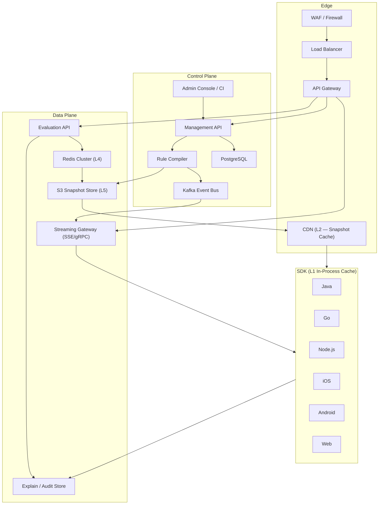
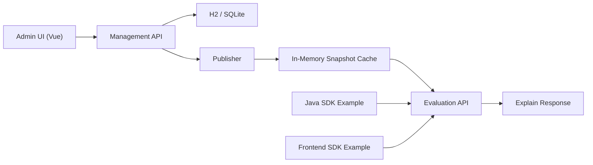

# Feature Management Service Design

## 1. Purpose

This document describes a practical design for a Feature Management Service for an e-commerce platform. The system manages feature flags across web portals, backend services, and mobile clients. It needs to support low-latency evaluation (P99 < 5 ms for in-process evaluation), controlled rollout, clear ownership, and explainable decisions.

Because this is a take-home interview project, the design intentionally separates:

- what a production-grade system should support
- what the demo implementation should build
- what should be documented but not implemented in the demo

The goal of the demo is not to rebuild LaunchDarkly. The goal is to show strong engineering judgment: clear architecture, useful APIs, deterministic evaluation behavior, a well-designed five-level cache model, test coverage, and a path from demo to production.

## 2. Requirement Summary

The service should support:

- Thousands of feature flags across more than 100 applications and services
- Web, backend, and mobile clients
- High-throughput and low-latency flag evaluation — P99 < 5 ms for in-process evaluation
- Five-level cache hierarchy to keep distribution cost low as the catalog grows
- A client SDK model that is easy to integrate across multiple languages
- Management, distribution, evaluation, and explain APIs
- Observability and debugging support
- Explainability for each decision: which subject, which region, which rule, which rollout bucket, which snapshot version

## 3. Design Philosophy

The most important design choice is to split the system into two planes.

The **control plane** manages authoring, validation, publishing, audit, and governance. It can tolerate higher latency and stronger consistency requirements.

The **data plane** serves flag evaluation. It should be fast, highly available, cache-friendly, and independent from the control plane during normal runtime.

For the demo, this split can be represented inside a single Spring Boot application. The code should still keep the boundaries clear through packages and service responsibilities.

Key design decisions carried through both demo and production:

- Immutable, versioned, SHA-256 checksummed snapshots as the runtime unit — not individual flag records
- Scope-based packaging by `environment + appKey` — clients only receive flags they use
- SHA-256-based percentage rollout hashing with 0.01% granularity
- Standardized reason codes in every evaluation response
- Explainability as part of the evaluation contract, not a post-hoc log

## 4. High-Level Architecture

### 4.1 Production Architecture


```mermaid
flowchart TD
    subgraph Edge
        WAF["WAF / Firewall"]
        CDN["CDN (L2 — Snapshot Cache)"]
        LB["Load Balancer"]
        GW["API Gateway"]
    end

    subgraph ControlPlane["Control Plane"]
        AdminUI["Admin Console / CI"]
        MgmtAPI["Management API"]
        Compiler["Rule Compiler"]
        MetaDB["PostgreSQL"]
        Kafka["Kafka Event Bus"]
    end

    subgraph DataPlane["Data Plane"]
        EvalAPI["Evaluation API"]
        StreamGW["Streaming Gateway (SSE/gRPC)"]
        SnapshotStore["S3 Snapshot Store (L5)"]
        Redis["Redis Cluster (L4)"]
        Explain["Explain / Audit Store"]
    end

    subgraph SDK["SDK (L1 In-Process Cache)"]
        JavaSDK["Java"] & GoSDK["Go"] & JsSDK["Node.js"] & iOSSDK["iOS"] & AndroidSDK["Android"] & WebSDK["Web"]
    end

    WAF --> LB --> GW
    GW --> MgmtAPI & EvalAPI & StreamGW
    AdminUI --> MgmtAPI
    MgmtAPI --> MetaDB & Compiler
    Compiler --> SnapshotStore & Kafka
    SnapshotStore --> CDN --> SDK
    Kafka --> StreamGW --> SDK
    EvalAPI --> Redis --> SnapshotStore
    EvalAPI --> Explain
    SDK --> Explain
```

### 4.2 Demo Architecture


```mermaid
flowchart LR
    A["Admin UI (Vue)"] --> B["Management API"]
    B --> C["H2 / SQLite"]
    B --> D["Publisher"]
    D --> E["In-Memory Snapshot Cache"]
    E --> F["Evaluation API"]
    F --> G["Explain Response"]
    H["Java SDK Example"] --> F
    I["Frontend SDK Example"] --> F
```

The demo keeps the architecture simple:

- One Spring Boot backend
- One local H2 or SQLite database (Oracle configuration documented for production)
- One in-memory snapshot cache keyed by `environment:appKey`
- One Vue admin frontend
- One Java SDK example
- One frontend TypeScript SDK example
- Focused unit and integration tests

## 5. Production vs Demo Scope

| Area | Production Design | Demo Implementation |
| --- | --- | --- |
| Backend | Separately deployed control plane and data plane | Single Spring Boot application with clear package boundaries |
| Database | Oracle (or PostgreSQL) | Local H2 or SQLite for easy setup |
| Cache | L1 SDK + L2 CDN + L3 JVM + L4 Redis + L5 S3 | In-memory snapshot cache in the backend |
| Cache invalidation | Push-first via Kafka + Streaming Gateway, delta sync | Manual publish creates a new snapshot version; cache reloads on next request |
| Config distribution | SSE / WebSocket / gRPC streaming with delta sync | SDK calls evaluation API directly; no streaming |
| SDK | Java, Go, Node.js, iOS, Android, Web | Java SDK example and TypeScript frontend SDK example |
| Frontend | Full admin console with RBAC and approval workflows | Vue UI for managing flags, rules, publishing, and evaluation playground |
| Observability | OpenTelemetry, Prometheus, Grafana, ELK, alerting | Structured logs, health endpoint, metrics-ready code |
| Security | RBAC, signed SDK keys, WAF, TLS, PII hashing | Simple API key or no auth — documented as demo scope |
| Explainability | Sampled traces + debug-on-demand in Elasticsearch | Explain API returns full decision details synchronously |
| Deployment | Kubernetes multi-region with active-active data plane | Local JAR or Docker Compose |
| Disaster recovery | RTO < 30 s for data plane via stale snapshot fallback | N/A |

## 6. Recommended Demo Scope

Recommended implementation:

1. Spring Boot backend (Java 17)
2. H2 local database with production-style schema
3. REST APIs for flag management, publishing, evaluation, and explanation
4. In-memory snapshot cache keyed by `environment:appKey`
5. Evaluation engine with all five reason codes
6. Vue frontend (flag list, rule editor, publish button, evaluation playground with explain output)
7. Java SDK example (thin client calling remote evaluation API)
8. TypeScript frontend SDK example
9. Java unit tests for the evaluation engine
10. README explaining production extensions

Recommended non-goals for the demo:

- Multi-region K8S deployment
- Real-time streaming distribution (Kafka + SSE)
- Redis, CDN, or S3
- Oracle-specific stored procedures
- Full RBAC and approval workflows
- Multi-language SDK matrix
- Full observability stack

## 7. Backend Design

### 7.1 Package Structure

```text
com.example.featureflag
  api
    FlagController
    RuleController
    EvaluationController
    PublishController
    AuditController
  application
    FlagService
    RuleService
    PublishService
    EvaluationService
    ExplainService
  domain
    Flag
    FlagRule
    Segment
    ConfigSnapshot
    EvaluationResult
    EvaluationDetails
    ReasonCode          ← enum: FLAG_NOT_FOUND, FLAG_DISABLED, RULE_MATCH,
                                ROLLOUT_NOT_INCLUDED, DEFAULT_VALUE
  infrastructure
    repository
      FlagRepository
      RuleRepository
      SnapshotRepository
      AuditLogRepository
    cache
      SnapshotCache     ← in-memory, keyed by "environment:appKey"
    persistence
      SchemaInitializer
  sdkexample
    java
    frontend
```

The package structure makes it obvious which parts belong to management, publishing, and evaluation even in the monolith demo.

### 7.2 Should the Demo Use Spring Boot?

Yes. Spring Boot is a good fit:

- Common in enterprise e-commerce systems
- Maps well to Oracle in production
- Supports REST, validation, persistence, and testing cleanly
- Easy to run and review locally

## 8. Database Design

### 8.1 Production Database

Production should use Oracle or PostgreSQL.

- Strong consistency for management data
- Auditability
- Transactional flag publishing
- Integration with existing enterprise data governance

Keep all SQL behind repository interfaces so the database can be swapped without touching domain logic.

### 8.2 Demo Database

Use H2 with Spring Boot JPA for local development.

```yaml
# application-local.yml
spring:
  datasource:
    url: jdbc:h2:mem:featureflag
  h2.console.enabled: true

# application-prod.yml (placeholder)
spring:
  datasource:
    url: jdbc:oracle:thin:@//host:1521/service
```

### 8.3 Core Tables

#### `ff_application`

| Column | Type | Notes |
| --- | --- | --- |
| `id` | bigint | Primary key |
| `app_key` | varchar(64) | Stable application key, unique |
| `name` | varchar(128) | Display name |
| `owner` | varchar(128) | Team or owner |
| `created_at` | timestamp | |
| `updated_at` | timestamp | |

#### `ff_flag`

| Column | Type | Notes |
| --- | --- | --- |
| `id` | bigint | Primary key |
| `flag_key` | varchar(128) | Unique within `app_key` |
| `app_key` | varchar(64) | Application scope |
| `environment` | varchar(32) | dev, staging, prod |
| `name` | varchar(128) | Display name |
| `description` | text | Human-readable description |
| `type` | varchar(16) | boolean, string, number, json |
| `default_value` | text | Default value |
| `enabled` | boolean | Global enabled state |
| `release_key` | varchar(128) | Optional release association |
| `status` | varchar(16) | draft, active, archived |
| `created_at` | timestamp | |
| `updated_at` | timestamp | |

#### `ff_rule`

| Column | Type | Notes |
| --- | --- | --- |
| `id` | bigint | Primary key |
| `flag_id` | bigint | FK to `ff_flag` |
| `priority` | int | Lower = evaluated first |
| `condition_json` | text | Rule conditions (attribute, operator, value) |
| `rollout_bps` | int | Rollout in basis points (0–10000); 5000 = 50% |
| `variation_value` | text | Value returned when matched and rollout passes |
| `enabled` | boolean | Whether this rule is active |
| `created_at` | timestamp | |
| `updated_at` | timestamp | |

#### `ff_segment`

| Column | Type | Notes |
| --- | --- | --- |
| `id` | bigint | Primary key |
| `segment_key` | varchar(128) | Unique segment key |
| `name` | varchar(128) | Display name |
| `definition_json` | text | Segment conditions or imported member reference |
| `created_at` | timestamp | |
| `updated_at` | timestamp | |

#### `ff_config_snapshot`

| Column | Type | Notes |
| --- | --- | --- |
| `id` | bigint | Primary key |
| `app_key` | varchar(64) | Application scope |
| `environment` | varchar(32) | Environment |
| `version` | bigint | Monotonic version per `app_key + environment` |
| `checksum` | varchar(128) | SHA-256 of snapshot payload |
| `snapshot_json` | text | Full compiled runtime snapshot |
| `published_by` | varchar(128) | User or system actor |
| `published_at` | timestamp | Publish time |

#### `ff_audit_log`

| Column | Type | Notes |
| --- | --- | --- |
| `id` | bigint | Primary key |
| `actor` | varchar(128) | User or system actor |
| `action` | varchar(32) | create, update, publish, rollback, archive |
| `resource_type` | varchar(32) | flag, rule, segment, snapshot |
| `resource_key` | varchar(256) | Business key |
| `before_json` | text | Previous state (nullable) |
| `after_json` | text | New state (nullable) |
| `created_at` | timestamp | Event time |

## 9. Snapshot and Cache Design

### 9.1 Snapshot Structure

Publishing compiles all active flags and rules for an `appKey + environment` into an immutable snapshot:

```json
{
  "appKey": "checkout-service",
  "environment": "prod",
  "version": 42,
  "checksum": "sha256:abc123ef...",
  "publishedAt": "2026-05-21T08:00:00Z",
  "flags": [
    {
      "flagKey": "new-checkout",
      "type": "boolean",
      "enabled": true,
      "defaultValue": false,
      "releaseKey": "release-2026-05-checkout",
      "rules": [
        {
          "ruleId": "rule-1",
          "priority": 1,
          "conditions": [
            { "attribute": "region", "operator": "equals", "value": "cn-east" }
          ],
          "rolloutBps": 5000,
          "variationValue": true
        }
      ]
    }
  ]
}
```

Notes:
- `rolloutBps` stores rollout as basis points (0–10000) for 0.01% granularity
- `checksum` is SHA-256 of the canonical JSON payload
- Snapshot is write-once; never mutated after publish

### 9.2 Five-Level Cache (Demo vs Production)

| Level | Description | Demo | Production |
| --- | --- | --- | --- |
| L1 | SDK in-process memory | Not applicable (SDK calls API directly) | SDK holds compiled snapshot |
| L2 | CDN edge | Not implemented | CloudFront / CDN serves immutable snapshots |
| L3 | JVM / server cache | In-memory `ConcurrentHashMap` in backend | In-memory cache per evaluation node |
| L4 | Redis cluster | Not implemented | Redis holds latest snapshot per scope |
| L5 | Persistent storage | H2 `ff_config_snapshot` table | S3-compatible object storage |

Demo cache design:

```text
key   = environment + ":" + appKey
value = latest ConfigSnapshot object (deserialized)
```

On publish: update L3 in-memory cache. On evaluation: read from L3. If absent, load from H2 (L5) and populate L3.

Production extends this to L1–L5 with event-driven invalidation via Kafka and streaming gateway.

### 9.3 Delta Sync (Production)

SDKs track:

```json
{
  "scope": "prod:checkout-web",
  "version": 124,
  "checksum": "sha256:abc123ef...",
  "lastRefreshedAt": "2026-05-21T08:00:00Z"
}
```

On publish event:
1. Streaming gateway pushes `{scope, newVersion, checksum}`
2. SDK fetches delta if within retention window, or full snapshot otherwise
3. SDK validates checksum, atomically swaps in-memory snapshot

## 10. Evaluation Engine

### 10.1 Evaluation Algorithm

```text
evaluate(snapshot, flagKey, context, callerDefault):

1. Find flag in snapshot by flagKey
   → if not found: return {value: callerDefault, reasonCode: FLAG_NOT_FOUND}

2. If flag.enabled == false:
   → return {value: flag.defaultValue, reasonCode: FLAG_DISABLED}

3. For each rule ordered by priority (ascending):
   a. Evaluate rule.conditions against context.attributes
      → if no match: continue to next rule
   b. Compute rollout bucket:
      bucket = SHA-256(flagKey + ":" + context.subjectKey) % 10000
   c. If bucket < rule.rolloutBps:
      → return {value: rule.variationValue, reasonCode: RULE_MATCH, matchedRuleId: rule.ruleId}
   d. If bucket >= rule.rolloutBps:
      → record ROLLOUT_NOT_INCLUDED, continue to next rule

4. No rule matched or all rollout checks excluded subject:
   → return {value: flag.defaultValue, reasonCode: DEFAULT_VALUE}
```

### 10.2 Reason Codes

| Code | Meaning |
| --- | --- |
| `FLAG_NOT_FOUND` | Flag key does not exist in the active snapshot |
| `FLAG_DISABLED` | Flag exists but `enabled = false`; returns flag default |
| `RULE_MATCH` | A rule matched and the subject passed rollout; returns variation |
| `ROLLOUT_NOT_INCLUDED` | A rule's conditions matched but subject's bucket excluded it |
| `DEFAULT_VALUE` | No rule matched; flag default value returned |
| `PREREQUISITE_FAILED` | A required prerequisite flag was not satisfied |
| `STALE_SNAPSHOT_FALLBACK` | No fresh snapshot available; using last known good |

### 10.3 Rollout Hashing

```java
// Deterministic, cross-language compatible
String seed = flagKey + ":" + subjectKey;
byte[] hash = MessageDigest.getInstance("SHA-256").digest(seed.getBytes(UTF_8));
long bucket = (Longs.fromByteArray(Arrays.copyOf(hash, 8)) & Long.MAX_VALUE) % 10000;
boolean included = bucket < rolloutBps;
```

Using SHA-256 and 10,000 modulus:
- Guarantees uniform distribution
- 0.01% minimum granularity per rollout step
- Same result in Java, Go, Python, Swift, Kotlin, TypeScript — verified by golden test vectors

### 10.4 Condition Operators

| Operator | Description |
| --- | --- |
| `equals` | Exact string match |
| `not_equals` | Negated string match |
| `contains` | Substring match |
| `in` | Value in a set |
| `not_in` | Value not in a set |
| `semver_gte` | Semantic version greater or equal |
| `semver_lt` | Semantic version less than |
| `regex` | Regular expression match |

## 11. Explainability Design

Explainability is part of the evaluation contract, not a separate afterthought.

### 11.1 Explain Endpoint

```
POST /api/v1/evaluations:explain
```

### 11.2 Example Response

```json
{
  "flagKey": "new-checkout",
  "finalValue": true,
  "reasonCode": "RULE_MATCH",
  "appKey": "checkout-service",
  "environment": "prod",
  "subjectKeyHash": "sha256:d4e5f6...",
  "matchedRuleId": "rule-1",
  "matchedConditions": ["region equals cn-east"],
  "evaluatedRuleCount": 2,
  "rolloutBucket": 3721,
  "rolloutBps": 5000,
  "releaseKey": "release-2026-05-checkout",
  "snapshotVersion": 42,
  "evaluatedAt": "2026-05-21T08:00:01Z"
}
```

Note: `subjectKey` is never logged raw. It is always SHA-256 hashed before storage.

### 11.3 Production Trace Strategy

- Default: sample evaluation traces at 1%
- Debug-on-demand: enable full tracing per `flagKey`, `subjectKey`, or `traceId` without redeployment
- Stored in Elasticsearch for queryability
- Retention policy: 30 days for sampled traces, 7 days for full debug traces

## 12. API Design

### 12.1 Management APIs

| Method | Endpoint | Purpose |
| --- | --- | --- |
| `POST` | `/api/v1/apps` | Register an application scope |
| `GET` | `/api/v1/apps` | List application scopes |
| `POST` | `/api/v1/flags` | Create a flag |
| `GET` | `/api/v1/flags?appKey=&environment=` | List flags |
| `GET` | `/api/v1/flags/{flagKey}` | Get flag details |
| `PATCH` | `/api/v1/flags/{flagKey}` | Update flag metadata |
| `POST` | `/api/v1/flags/{flagKey}/rules` | Add a targeting rule |
| `PATCH` | `/api/v1/rules/{ruleId}` | Update a rule |
| `DELETE` | `/api/v1/rules/{ruleId}` | Delete a rule |
| `POST` | `/api/v1/flags/{flagKey}/archive` | Archive a flag |

### 12.2 Publishing APIs

| Method | Endpoint | Purpose |
| --- | --- | --- |
| `POST` | `/api/v1/publish` | Compile and publish new snapshot |
| `POST` | `/api/v1/flags/{flagKey}/rollback` | Roll back to previous snapshot version |
| `GET` | `/api/v1/snapshots/latest?appKey=&environment=` | Get latest snapshot metadata |
| `GET` | `/api/v1/snapshots/{version}?appKey=&environment=` | Get specific snapshot |

### 12.3 Evaluation APIs

| Method | Endpoint | Purpose |
| --- | --- | --- |
| `POST` | `/api/v1/evaluations/flags/{flagKey}` | Evaluate one flag |
| `POST` | `/api/v1/evaluations:batch` | Evaluate multiple flags |
| `POST` | `/api/v1/evaluations:explain` | Evaluate with full decision trace |

Single flag request:

```json
{
  "appKey": "checkout-service",
  "environment": "prod",
  "flagKey": "new-checkout",
  "context": {
    "subjectKey": "user-123",
    "attributes": {
      "region": "cn-east",
      "platform": "ios",
      "appVersion": "9.2.1",
      "membershipLevel": "gold"
    }
  }
}
```

Single flag response:

```json
{
  "flagKey": "new-checkout",
  "enabled": true,
  "value": true,
  "reasonCode": "RULE_MATCH",
  "matchedRuleId": "rule-1",
  "snapshotVersion": 42,
  "releaseKey": "release-2026-05-checkout"
}
```

### 12.4 Supporting APIs

| Method | Endpoint | Purpose |
| --- | --- | --- |
| `GET` | `/actuator/health` | Health check |
| `GET` | `/api/v1/audit-logs?appKey=&environment=` | List audit records |
| `GET` | `/api/v1/flags/{flagKey}/history` | Change history for a flag |
| `GET` | `/api/v1/demo/context-template` | Sample evaluation context for playground |

## 13. Vue Frontend Design

### 13.1 Recommended Pages

- Application selector
- Flag list (with status chips: draft / active / archived)
- Flag create / edit form
- Rule editor (priority-ordered, with condition builder)
- Publish snapshot button (shows current version, confirms before publish)
- Rollback option (select a previous snapshot version)
- Evaluation playground
- Explain result panel

### 13.2 Evaluation Playground

The most valuable screen. Let a reviewer:

1. Choose app and environment
2. Choose a flag
3. Edit JSON context (with template helper)
4. Click Evaluate
5. See: final value, reason code, matched rule ID, rollout bucket vs threshold, snapshot version

This demonstrates the real behavior of the system better than a large admin UI.

## 14. Java SDK Example

### 14.1 API

```java
FeatureClient client = FeatureClient.builder()
    .baseUrl("http://localhost:8080")
    .appKey("checkout-service")
    .environment("local")
    .build();

boolean enabled = client.boolVariation(
    "new-checkout",
    FeatureContext.builder()
        .subjectKey("user-123")
        .attribute("region", "cn-east")
        .attribute("platform", "ios")
        .build(),
    false // caller-provided default
);

EvaluationDetails details = client.getEvaluationDetails(
    "new-checkout",
    FeatureContext.builder().subjectKey("user-123").build(),
    false
);
// details.getReasonCode() == ReasonCode.RULE_MATCH
// details.getMatchedRuleId() == "rule-1"
// details.getSnapshotVersion() == 42
```

### 14.2 Demo vs Production SDK

For the demo, the Java SDK calls the remote evaluation API directly.

Production SDK additions (documented, not implemented in demo):
- Local snapshot cache (L1) loaded on startup
- Background streaming connection (SSE or gRPC) for push updates
- Polling fallback if streaming disconnects
- Offline fallback from last persisted snapshot
- Exposure event batching with async flush
- Golden test vector harness for consistency verification

## 15. TypeScript Frontend SDK Example

### 15.1 API

```typescript
const client = createFeatureClient({
  baseUrl: "http://localhost:8080",
  appKey: "checkout-web",
  environment: "local",
});

const enabled = await client.boolVariation("new-checkout", {
  subjectKey: "user-123",
  attributes: { region: "cn-east", platform: "web" },
}, false);

const details = await client.getEvaluationDetails("new-checkout", {
  subjectKey: "user-123",
  attributes: { region: "cn-east", platform: "web" },
}, false);
// details.reasonCode === "RULE_MATCH"
```

### 15.2 Security Note for Production Web SDKs

Public browser clients must not receive sensitive rule logic or backend credentials.

Production web SDK considerations:
- Use public client keys (not backend API keys)
- Optionally use server-side evaluation for sensitive flags
- Context attribute minimization (send only what the server needs)
- Exposure event batching to avoid per-evaluation network calls

## 16. Testing Strategy

### 16.1 Evaluation Engine Unit Tests

These are the most important tests. They prove deterministic evaluation behavior independently of persistence and controllers.

Required test cases:

| Test Case | Expected Reason Code |
| --- | --- |
| Flag key not in snapshot | `FLAG_NOT_FOUND` |
| Flag exists but `enabled = false` | `FLAG_DISABLED` |
| Rule conditions match, rollout bucket passes | `RULE_MATCH` |
| Rule conditions match, rollout bucket excluded | `ROLLOUT_NOT_INCLUDED` |
| No rule matches | `DEFAULT_VALUE` |
| Rule priority order is respected | — |
| Same subject, same flag always returns same bucket | — |
| Different subjects produce distribution across rollout | — |
| Rollout at exactly 0% always excluded | — |
| Rollout at exactly 100% always included | — |
| Explain response includes correct matchedRuleId and rolloutBucket | — |
| Snapshot publish increments version monotonically | — |
| Rollback restores prior snapshot | — |

### 16.2 Test Pyramid

| Layer | Scope |
| --- | --- |
| Unit tests | Evaluation engine, rollout hashing, rule condition evaluation |
| Repository tests | Snapshot persistence, version increment |
| Controller tests | API contract for evaluate, explain, publish |
| End-to-end demo test | Create flag → add rule → publish → evaluate → explain |

## 17. Observability Design

### 17.1 Demo

- Structured JSON logs including `appKey`, `environment`, `flagKey`, `snapshotVersion`, `reasonCode`, `matchedRuleId`, `traceId`
- Spring Boot Actuator health endpoint
- Metrics-ready code (counters and timers named but not wired to Prometheus)

### 17.2 Production

| Signal | Tool |
| --- | --- |
| Metrics | Prometheus + Grafana |
| Logs | ELK (Elasticsearch + Logstash + Kibana) |
| Traces | OpenTelemetry → Jaeger or Zipkin |
| Alerting | Prometheus Alertmanager |

Key metrics:

| Metric | Alert Threshold |
| --- | --- |
| Evaluation p99 latency | > 5 ms |
| Snapshot publish latency | > 10 s |
| Latest snapshot age | > SLO window |
| L4 Redis cache hit rate | < 85% |
| Evaluation QPS | Track, no threshold |
| SDK stream reconnect rate | > 50/s |

## 18. Security and Governance

### 18.1 Demo

- Simple static API key or no auth (clearly documented)
- No PII stored in logs

### 18.2 Production

| Area | Implementation |
| --- | --- |
| Auth | RBAC by team, app, and environment |
| Approvals | Approval workflow for production publishes; fast-path for kill switches |
| Audit | Immutable `ff_audit_log` for all management mutations |
| SDK credentials | Rotating signed API keys; separate keys per app scope |
| Transport | TLS 1.3 everywhere |
| Storage | AES-256 at rest |
| PII | `subjectKey` always SHA-256 hashed before logging; sensitive attributes redacted |
| WAF | DDoS protection, abnormal polling pattern blocking |

## 19. Implementation Plan

### Stage 1 — Backend Core

- Create Spring Boot project with H2 local profile
- Implement `ff_application`, `ff_flag`, `ff_rule`, `ff_config_snapshot`, `ff_audit_log` tables
- Implement flag and rule management APIs
- Implement `PublishService`: compile snapshot, store in DB, update in-memory L3 cache
- Implement `EvaluationService`: load from cache, execute evaluation algorithm with all five reason codes
- Add SHA-256 rollout hashing with `rolloutBps` (0–10000) precision
- Add unit tests for evaluation engine

### Stage 2 — Explainability and API Polish

- Implement explain endpoint with full decision trace
- Add `subjectKeyHash` (SHA-256) to explain response
- Add audit log records for create / update / publish / rollback
- Add rollback API
- Add OpenAPI documentation or README API examples
- Add controller tests

### Stage 3 — Vue Frontend

- Application and flag list screens
- Flag create / edit form
- Rule editor with priority control
- Publish button (with version confirmation)
- Evaluation playground with explain output panel

### Stage 4 — SDK Examples

- Java SDK client with `boolVariation`, `getEvaluationDetails`
- TypeScript frontend SDK
- README usage snippets showing all reason code behaviors

## 20. Estimated Effort With AI Assistance

| Scope | Estimated Time |
| --- | --- |
| Backend APIs, H2, evaluation engine, unit tests | 8–12 hours |
| Vue admin UI and evaluation playground | 4–8 hours |
| Java SDK example and TypeScript SDK example | 3–5 hours |
| README, diagrams, polish, manual testing | 2–4 hours |
| **Total** | **2–3 days** |

A backend-only version (no frontend, no SDK examples) could be completed in 1 day.

A production-grade version with K8S multi-region deployment, Kafka streaming, Redis, CDN, RBAC, audit dashboards, multi-language SDK matrix, and full observability would take multiple weeks.

## 21. Final Recommendation

For this interview project, the best balance is:

- Spring Boot backend (Java 17)
- H2 locally, Oracle configuration documented for production
- Evaluation engine with all five reason codes implemented correctly
- SHA-256 rollout hashing at 0.01% granularity
- In-memory snapshot cache (L3) as the runtime evaluation source
- Immutable versioned snapshots in database (L5)
- Explain API as part of the evaluation contract
- Java unit tests for the evaluation engine
- Compact Vue frontend focused on the evaluation playground
- Java SDK example and TypeScript SDK example
- README documenting production extensions (L1–L5 cache, K8S, streaming, Oracle, RBAC)

This scope demonstrates architectural thinking, engineering ability, and production awareness — without turning the assignment into an unrealistic platform rebuild.
